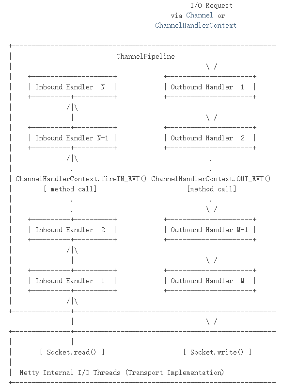
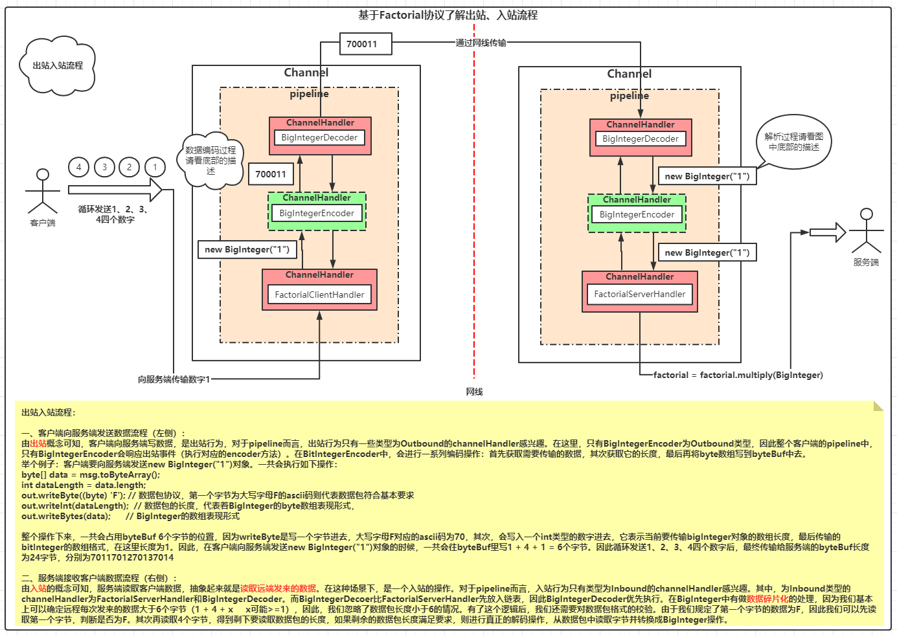
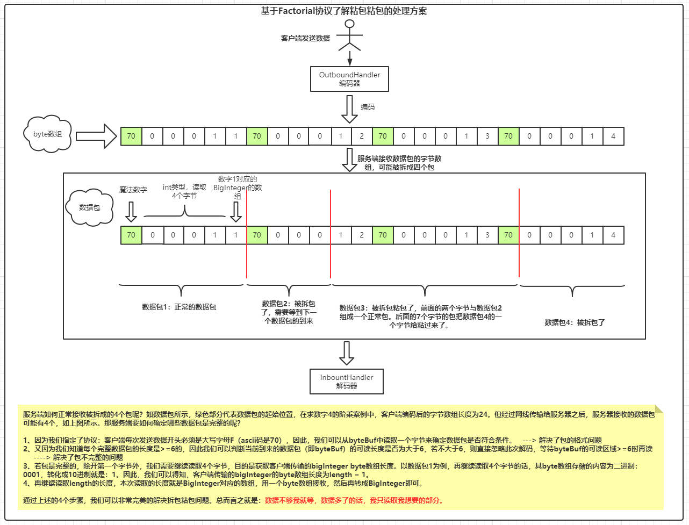
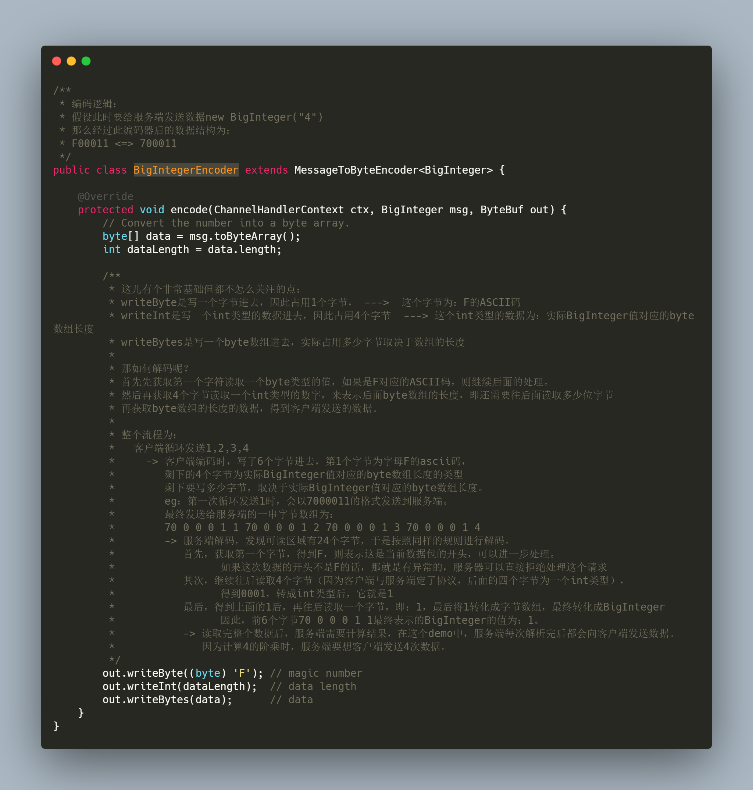
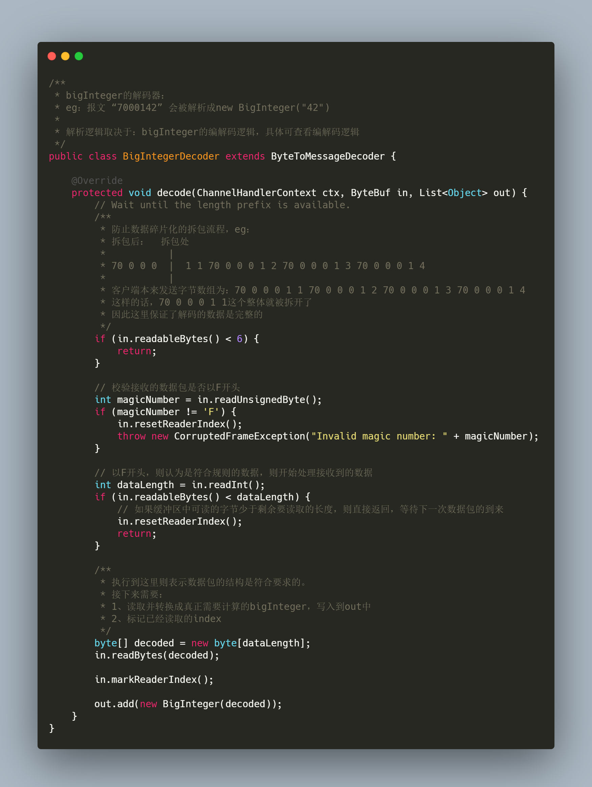
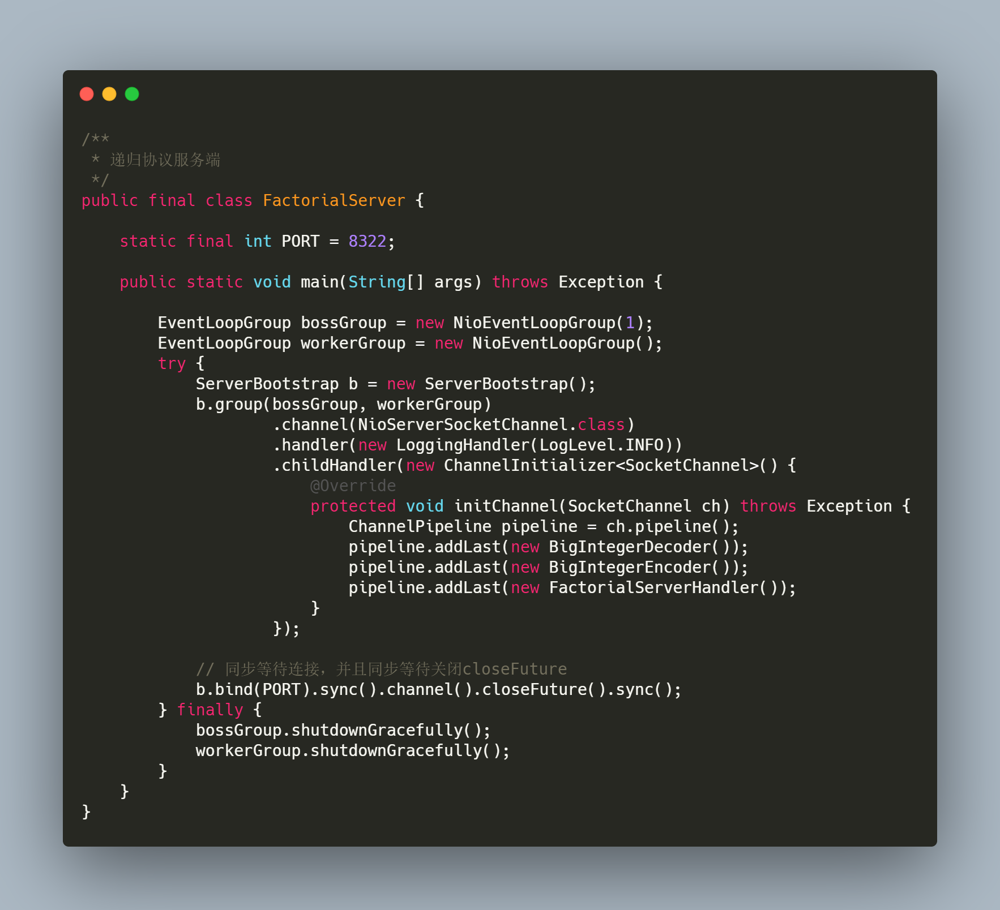
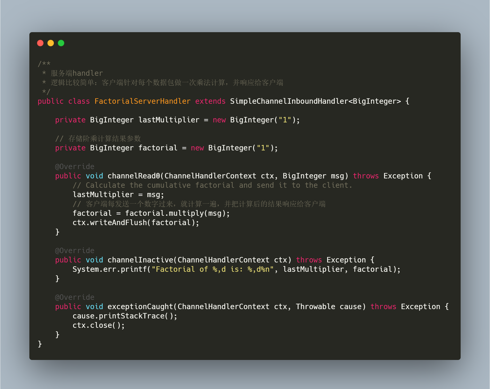
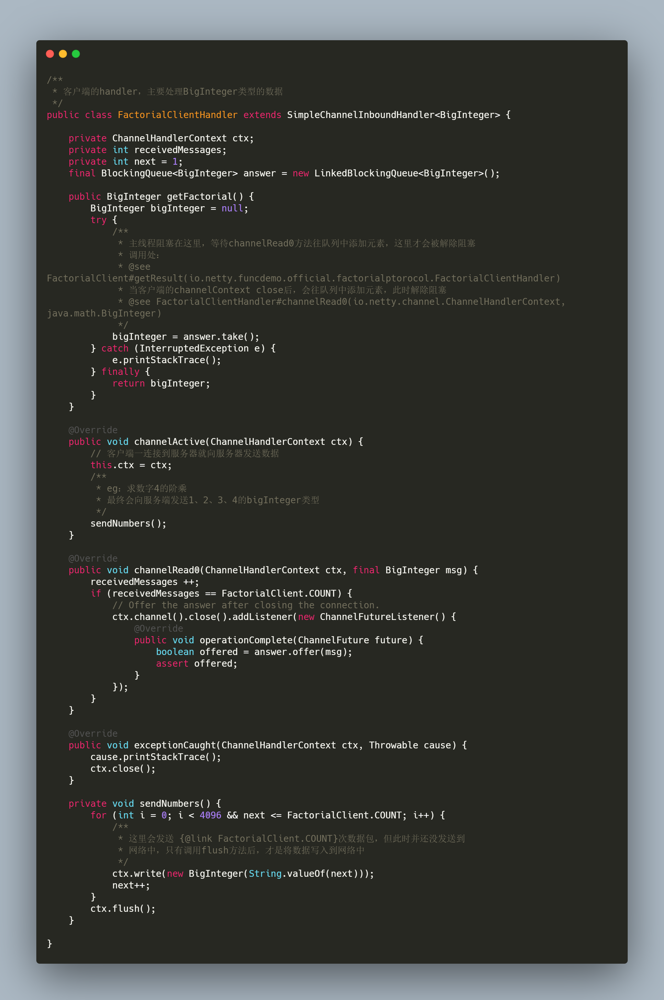

# 前言

* 上篇文章中，我们基于Netty开发了discard和time协议的网络应用程序。但我们还不是特别了解客户端与服务端在netty中的数据处理大致流程。本次总结的目的就在于：**了解netty在交互数据时涉及到的一些基础知识：出站入站（数据处理流程）、粘包拆包**。本次，我们还是使用官网的案例（**[Factorial Protocol](https://netty.io/4.1/xref/io/netty/example/factorial/package-summary.html)**）来说明问题，但官网的案例支持了**SSL**，为了增加代码的阅读和理解，本人将部分内容做了改版，升级成一个简单版基于factorial protocol的网络应用程序。接下来一起来了解下官网的factorial案例吧。

## 一、factorial protocol是什么

* 顾名思义：它是一个**阶乘**的协议，其主要的功能就是：**客户端向服务端发送一个数字，由服务端做递归计算，最终客户端打印计算后的结果**。以客户端发送数字10为例。在此协议中，**为了模拟同时发送多个请求的情况**，实现的逻辑为：客户端循环10次，将1、2、3、4、5、6、7、8、9、10这10个数字组装成一个报文请求到服务端，服务端**需要解析每一个数字**然后做乘法计算，每计算一次后将结果返回给客户端，因此客户端会收到10次服务器响应的数据。
* 从单纯的递归功能去思考，很容易发现它有如下几个明显的问题

  1. 什么时候截取数字？比如我发送78910这四个数字，如何区分要对7、8、9、10做乘积计算？
  2. 如官网的time protocol demo一样，可能会出现**数据碎片化情况（粘包拆包）**
  3. 假设被计算的数字为：**30**，它的阶乘为：**265252859812191058636308480000000**。根据我们java中基本数据类型长度可知：此时只有**Long（8byte = 64bit）**能存储。但为了能支持更大数字的计算，因此需要使用**BigInteger**类型来接收结果值，进而我们需要添加BigInteger的**编解码器**
  
* 接下来，我们直接看代码。

## 二、前置知识点

### 2.1 入站 & 出站概念

* 这里先引用下官网的ChannelPipeline结构图：

  > 
  >
  > 官方解释：
  >
  > 1. 入站：如上图的**左侧**所示，是一个自下而上的过程，通常由**SocketChannel.read(ByteBuffer)**操作触发，经常用于**读取远程发来的数据**，对应的**input**操作。
  > 2. 出站：如上图的**右侧**所示，是一个自上而下的过程，通常由**SocketChannel.write(ByteBuffer)**操作触发，经常用于**向远程写数据**，对应的是**output**操作。

* 假设有如下代码：

  ```java
  ChannelPipeline p = ...;
  p.addLast("1", new InboundHandlerA());
  p.addLast("2", new InboundHandlerB());
  p.addLast("3", new OutboundHandlerA());
  p.addLast("4", new OutboundHandlerB());
  p.addLast("5", new InboundOutboundHandlerX());
  ```

  其中，**1，2，5**实现了Inbound接口，**3，4，5**实现了Outbound接口。当有入站事件发生时，**1，2，5**将被调用。当有出站事件发生时，**3，4，5**将被调用。有了这样的概念后，咱们来看看netty中常见的一些编码、解码器都实现了哪些接口。

### 2.2 常用的编码器和解码器

* 我们经常使用**ByteToMessageDecoder**解码器来解码数据，目的是将byteBuf中的byte数组内部的数据转化成我们关注的类型，根据我们上面总结的入站概念以及结合我们的解码器调用时机分析后（解码器是接收数据时才需要被解码，而刚刚我们说了，对于我们解码器所在的端而言，它其实是要**读取远程发来的数据**）：解码器一定是实现了Inbound接口。其继承图如下所示：

  

* 同上，我们经常使用**MessageToByteEncoder**编码器来编码数据，目的是将我们**自定义的对象**编码成byte数组。根据我们上面总结的出战概念以及结合我们的编码器调用时机分析后（编码器是发送数据前的最后一道路，需要将我们自定义的对象编码成字节数组，才能在网络中传输）：编码器一定是实现了Outbound接口。其继承图如下所示：

  

### 2.3 factorial protocol处理数据碎片化的解决方案 & 入站出站执行流程

* 在time protocol中其实也有说过官方处理**数据碎片化**的两种解决方案，在本例中，我们直接采取第二种解决方案来处理。其中，还包含了**数据包收发的特殊定义**，在这种定义下，可以**解决数据格式不统一、数据碎片化的情况**，详细的**出站入站流程**细看下图：

  

  **数据碎片化（拆包粘包）解决方案**细看下图：

  

## 三、代码实现

* 先看我们的编解码器，对照上图来理解它处理数据碎片化的方案

### 3.1 编解码器

* 编码器

  

* 解码器

  

### 3.2  服务端 & 服务端handler

* 服务端启动类，其主要工作就是绑定端口，为pipeline添加指定的handler

  

* 服务端handler

  

### 3.3 客户端 & 客户端handler

* 客户端入口，其主要工作就是连接服务器，为pipeline添加指定的handler，获取服务端的计算结果

  

* 客户端handler

  

## 四、总结

* **本次总结，咱们从官网的Factorial Protocol出发，画图总结了出站入站的执行流程、粘包粘包的解决方案。在整理粘包拆包过程中，还对字节数组以及一些基本数据类型在字节数组中的存储方式（占用字节大小），在需要自己操作编解码操作时，这还是很重要的。**
* **如果你觉得我的文章有用的话，欢迎点赞、收藏和关注。:laughing:**
* **I'm a slow walker, but I never walk backwards**


