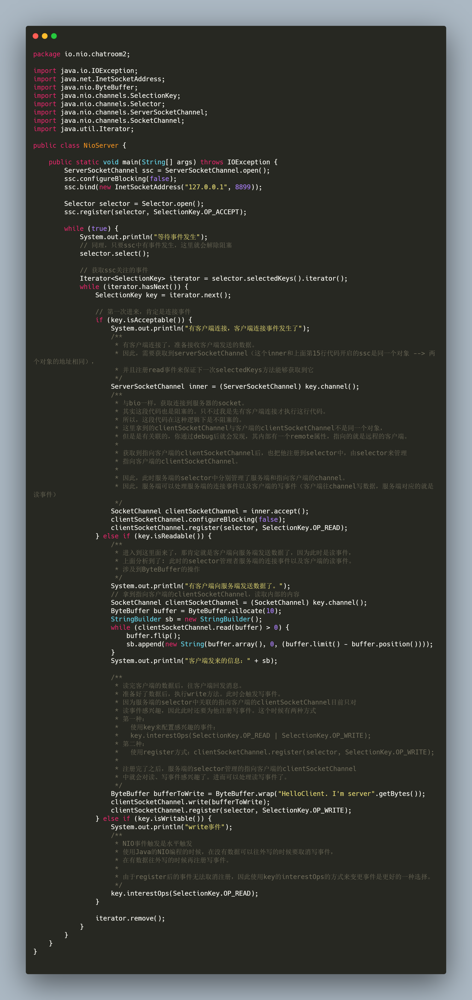
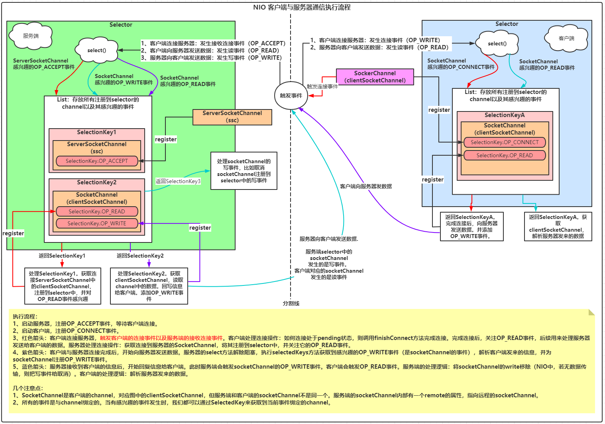

# 前言

* [上篇文档：IO系列学习总结二：认识NIO，从ByteBuffer开始](https://blog.csdn.net/avengerEug/article/details/113960479)，我们了解了NIO解决了BIO阻塞的问题来达到高并发的目的。其中，还用了三张图了解了NIO中的ByteBuffer及常用API。上文总结到NIO的几个核心组件：**Selector、SeletedKey、ByteBuffer、ServerSockerChannel、SocketChannel**，我们详细了解了ByteBuffer组件的底层原理。今天，**我们以三张图类来认识NIO程序通信的流程**。废话不多说，咱们直接进行今天旅程。

## 一、三张图

* 接下来的两个类（客户端 & 服务端）是一个简单的NIO通信程序，其中涉及到了Selector、SocketChannel、ServerSocketChannel、SelectedKey的常用api。其中会有一张图来全程贯穿这两个类的运行流程。代码也是以图片的形式展示的，建议自己能按照图片及图片中的注释敲一遍，学东西，得动起来！

* 客户端代码：

  

* 服务端代码：

  

* 代码执行流程：

  

## 二、Selector组件的作用

* 如上述执行流程图所示，selector在NIO的角色就是一个管理者：**所有的channel都会注册到selector中去，并且内部还管理着每个channel感兴趣的事件**。同时它性格比较单一，它的select()操作判断标准是：**只要有channel对应的事件发生了，就会解除阻塞，否则就会阻塞在那里，等待注册到selector中的channel有事件发生**。如**客户端代码注释**中提到：在处理OP_CONNECT事件时，把`socketChannel.register(selector, SelectionKey.OP_READ);`代码去掉，最终在服务器往客户端写数据时，客户端的socketChannel一直没有处理OP_READ事件，会导致外层的循环一直在空转。原因就是selector的select()方法发现socketChannel有事件发生，需要解除阻塞。
* 可以这么说：selector是NIO的核心，是NIO的上下文。它虽然也有阻塞的缺点，但在特殊的场景下，它永远不会阻塞，即最终变成了**非阻塞**。

## 三、SelectedKey

* 通过上述的三张图可知：当注册到selector中的channel有感兴趣的事件发生时，selector的selectedKeys方法就会找出所有的selectedKey，selectedKey就像是二雄的哆啦A梦：它可以提示二雄： **当前这个事件的类型、属于哪个channel，并且还具备修改channel关注的事件类型的作用，同时它的口袋（attachment）还能放下各种对象（`attachment在后面的reactor模型总结中再详细描述`）**。常用的SelectedKey包含的事件如下表所示：

  |    类型    |                事件类型                |   判断标准    |
  | :--------: | :------------------------------------: | :-----------: |
  | OP_CONNECT |       连接事件，一般客户端感兴趣       | isConnectable |
  |  OP_READ   |    读事件。客户端和服务端都会感兴趣    |  isReadable   |
  |  OP_WRITE  | 写事件。服务端感兴趣，客户端可能感兴趣 |  isWritable   |
  | OP_ACCEPT  |     接收连接事件。一般服务器感兴趣     | isAcceptable  |

## 四、Channel

* 通过上述的三张图可知：Channel的类型包含ServerSocketChannel和SocketChannel，前者是服务端的channel，后者是客户端的channel。它们都可以注册到selector中去，但前提是要配置阻塞为false。即如下代码：

  ```java
  Channel.configureBlocking(false);
  ```

  客户端与服务端的数据交互都会存在channel中，要从channel中获取数据，则需要我们之前讲到的ByteBuffer了。

## 五、总结

* **NIO与BIO相比，它的非阻塞体现在读数据的操作：在BIO中，客户端连接服务器后，如果客户端一直没有向服务器发送数据，服务器则会一直阻塞在read方法。而在NIO中，我们已经将channel交给selector去管理了，selector中的channel和channel之间是完全解耦的，channelA事件处理并不会因为channelB没有发生事件而阻塞，NIO面向的是selector中的每个channel，每个channel是相互独立的，不会互相影响。**
* **学习要动起来，建议看到这篇文章的读者能按照客户端和服务端的代码敲一遍，然后再对照执行流程图慢慢理解**
* **如果你觉得我的文章有用的话，欢迎点赞、收藏和关注。:laughing:**
* **I'm a slow walker, but I never walk backwards**