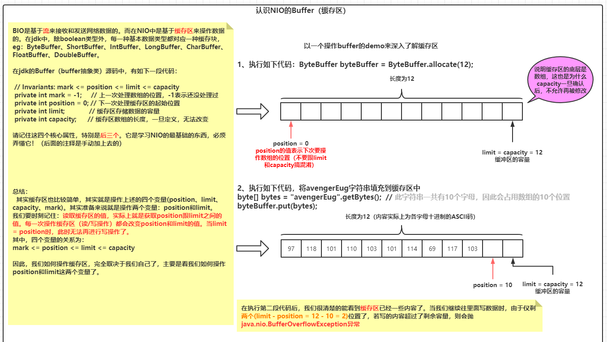
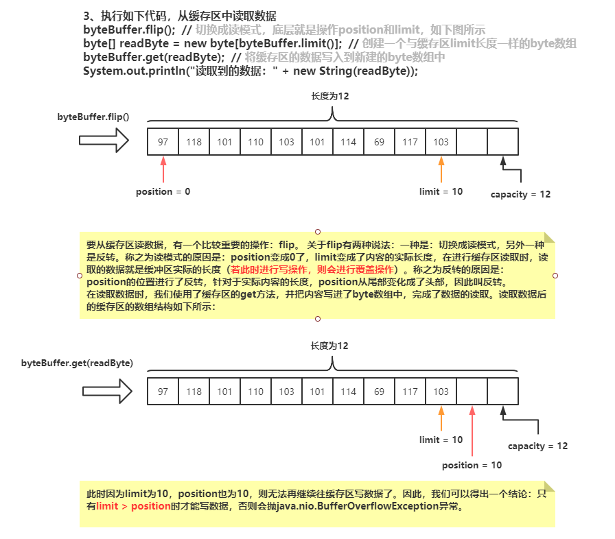
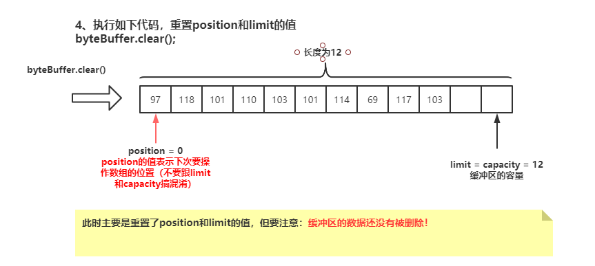

# 前言
* [上篇文章：IO系列学习总结一：做实验，从BIO单线程版本过渡到BIO多线程版本](https://blog.csdn.net/avengerEug/article/details/112203971)中介绍了什么是**IO**、**BIO**以及**BIO**阻塞的两个关键点，并针对BIO的两个阻塞点做了一定的扩展，使之能支持**有限**的连接请求达到**伪并发**的效果。虽然能绕开BIO的两个阻塞点来实现**伪并发**效果，但它毕竟是**伪**的。那要如何来解决根本问题呢？在JDK的api中，衍生出来了一个叫**NIO**的东西。它全称叫：**No Blocking IO**。顾名思义，它的出现就是用来解决BIO的阻塞问题的。下面我们来认识下NIO吧。

## 一、NIO(No Blocking IO)
* NIO的设计初衷是：**使用单线程来处理并发**，调用底层os中的函数（linux中是epoll，windows中为select）来实现。它主要是想解决**客户端连接**和**BIO中读数据**时的阻塞问题。NIO的知识点涉及到了多个名词（组件）：**多路复用器Selector、SelectedKey、ByteBuffer、Channel.....**其主要作用如下表所示：
	| 名词（组件）| 作用|
	|--|--|
	| selector | nio中的总管，所有的socketChannel都要注册到它上面去，后续由它来管理和分发所有socketChannel感兴趣的事件  |
	| selectedKey | 注册到selector中socketChannel需要自报家门：我对哪个事件感兴趣，而selectedKey描述的就是事件 |
	| ByteBuffer | 字节缓冲区，所有客户端与服务器交互的数据都由它来操作 |
	| ServerSocketChannel | NIO服务端的socket，通常会配置configureBlocking为非阻塞 |
	| SocketChannel | NIO客户端的socket |
	由于ByteBuffer与其他几个组件耦合性不是特别高，但它又是NIO**操作数据**的基石，本篇文档内容则以ByteBuffer展开，并以ByteBuffer的总结开始，进入NIO的大门。

## 二、ByteBuffer缓冲区

### 2.1 三张图 + 四个操作认识ByteBuffer

* 初始化固定长度的ByteBuffer并往里面添加**avengerEug**字符串

  
  
* 读取数据

  

* 重置缓冲区数据 （**但缓冲区的数据并没有被删除**）

  

### 2.2 ByteBuffer的总结

* 如果你跟着上面三张图的代码敲了一遍的话，你可能还有点懵，见识每一步操作都把ByteBuffer对象打印出来（ByteBuffer对象的toString方法重写了，会打印出position、limit、capacity的值）。如果还不是特别清楚的话，可以参考如下测试代码，一步一步的去理解：

  ```java
  public static void main(String[] args) {
      ByteBuffer byteBuffer = ByteBuffer.allocate(12);
  
      // 看一下初始状态的四个属性的值
      System.out.println("初始状态下四个属性的值：");
      System.out.println("limit: ==> " + byteBuffer.limit());
      System.out.println("position: ==> " + byteBuffer.position());
      System.out.println("capacity: ==>" + byteBuffer.capacity());
      System.out.println("mark: ==>" + byteBuffer.mark());
  
      System.out.println("-------------------分隔符--------------------");
      System.out.println("为byteBuffer填充一条字符串：avengerEug");
      byte[] bytes = "avengerEug".getBytes();
      byteBuffer.put(bytes);
      System.out.println("avengerEug字符串转成byte数组后的长度为：" + bytes.length);
  
      // ===> 此时在写两个字符进去的话，position会变成12，可以想象下，数组的长度为12，它的下标最大才11，如果下次操作下标为12的位置，那肯定会报错
      //        bytes = "eu".getBytes();
      //        byteBuffer.put(bytes);
  
      // ===> 结合上述写入"eu"字符的情况，由于position变成12了，此时若进行写数据，肯定直接报错
      //        bytes = "g".getBytes();
      //        byteBuffer.put(bytes);
  
      System.out.println("填充字符串后四个属性的值：");
      System.out.println("limit: ==> " + byteBuffer.limit());
      System.out.println("position: ==> " + byteBuffer.position()); // ===> 正在操作的位置变成了10，是因为avengerEug这个字符串转成byte数组后的长度为10
      System.out.println("capacity: ==>" + byteBuffer.capacity());
      System.out.println("mark: ==>" + byteBuffer.mark());
  
  
      System.out.println("-------------------分隔符--------------------");
      System.out.println("从byteBuffer中读取我们刚刚放进的数据，调用flip方法切换成读模式");
      // 要从byteBuffer中读取数据时，需要调用flip方法切换成读模式
      byteBuffer.flip();
      // 将position置为0后，再写数据，测试是否会覆盖 ==> 的确会覆盖，但同时也会修改position的值
      //        byteBuffer.put("xixi".getBytes());
      System.out.println("切换成读模式后四个属性的值：");
      System.out.println("limit: ==> " + byteBuffer.limit()); // ==> limit由12变成10了
      System.out.println("position: ==> " + byteBuffer.position()); // ==> position由10变成0了
      System.out.println("capacity: ==>" + byteBuffer.capacity());
      System.out.println("mark: ==>" + byteBuffer.mark());
      System.out.println("limit由12变成10了, position由10变成0了。\n 得出结论：当调用flip切换成读模式时，整个byteBuffer的限制大小仅仅为10。\n " +
                         "这是符合条件的，因为我们的缓冲区此时只有10个长度的数据，即avengerEug字符串转化成byte数组的长度");
  
      System.out.println("开始读取数据....");
      // 传入一个字节数组给get方法，字节数组的长度就是limit的值，执行完get方法后，会将数据填充到传入的byte数组中
      byte[] readByte = new byte[byteBuffer.limit() - byteBuffer.position()];
      byteBuffer.get(readByte);
      System.out.println("读取到的数据：" + new String(readByte));
      System.out.println("读取数据后的四个属性的值：");
      System.out.println("limit: ==> " + byteBuffer.limit());
      System.out.println("position: ==> " + byteBuffer.position()); // ==> position变成10了，正常。因为读取数据时操作到了10个位置
      System.out.println("capacity: ==>" + byteBuffer.capacity());
      System.out.println("mark: ==>" + byteBuffer.mark());
  
      // 此时无法再继续写数据了，因为limit为10，position也为10了，已经达到界限了。
      //         byteBuffer.put("as".getBytes());  // ==> 抛异常：java.nio.BufferOverflowException
  
      System.out.println("-------------------分隔符--------------------");
      System.out.println("调用clear方法，重回写模式，但缓冲区的数据会被清空，我们获取不到avengerEug数据了");
      // 重回写模式 --> 但要注意：缓存区的值还没有被删除，我依然可以读取缓存区的值
      byteBuffer.clear();
      System.out.println("重回写模式后的四个属性的值：");
      System.out.println("limit: ==> " + byteBuffer.limit());
      System.out.println("position: ==> " + byteBuffer.position());
      System.out.println("capacity: ==>" + byteBuffer.capacity());
      System.out.println("mark: ==>" + byteBuffer.mark());
      System.out.println("结论：当调用clear方法后，byteBuffer会被清空，相当于回到最原始的情况了");
  
      // 即时切回成了写模式，缓存区的值依然可以读取。
      readByte = new byte[byteBuffer.limit() - byteBuffer.position()];
      byteBuffer.get(readByte);
      System.out.println("读取到的数据：" + new String(readByte));
  }
  ```

## 三、ByteBuffer的其他API

### 3.1 put & get

* 使用byteBuffer 存储除boolean以外的基本数据类型

* 测试案例

  ```java
  ByteBuffer byteBuffer = ByteBuffer.allocate(1024);
  
  System.out.println("put值");
  // 默认put进去的就是byte  占用缓存区的1个字节位置
  byteBuffer.put(new Byte("97"));
  // 占用缓存区的2个字节位置
  byteBuffer.putShort((short) 10);
  // 占用缓存区的4个字节的位置
  byteBuffer.putInt(922);
  // 占用缓存区的8个字节的位置
  byteBuffer.putLong(108L);
  // 占用缓存区的4个字节的位置
  byteBuffer.putFloat(1.7F);
  // 占用缓存区的8个字节的位置
  byteBuffer.putDouble(2.2);
  // 占用缓存区的2个字节的位置
  byteBuffer.putChar((char) 97);
  
  System.out.println("---------------------------------------");
  System.out.println("执行到这里，一共会占用缓存区的29个字节, 因此limit为1024，potision为29，capacity为1024");
  System.out.println("limit => " + byteBuffer.limit());
  System.out.println("capacity => " + byteBuffer.capacity());
  System.out.println("position => " + byteBuffer.position());
  
  System.out.println("---------------------------------------");
  byteBuffer.flip();
  System.out.println("get值  ==> 比较重要：一定要按顺序读，否则读取出来的数据自己都不认识！");
  System.out.println(byteBuffer.get());
  System.out.println(byteBuffer.getShort());
  System.out.println(byteBuffer.getInt());
  System.out.println(byteBuffer.getLong());
  System.out.println(byteBuffer.getFloat());
  System.out.println(byteBuffer.getDouble());
  System.out.println(byteBuffer.getChar());
  ```

### 3.2 slice 

* 拷贝原有的byteBuffer，拷贝出来的缓存区和原缓存区共享byte数组的数据

* 测试案例：

  ```java
  // 创建长度为1的缓存区
  ByteBuffer byteBuffer = ByteBuffer.allocate(7);
  // 往缓存区放一个小写的a字母
  byteBuffer.put((byte) 97);
  byteBuffer.flip();
  System.out.println("缓存区的数据为：");
  System.out.println((char) byteBuffer.get());
  // 还原position的值
  byteBuffer.clear();
  
  /**
   * 使用slice方法创建出来新的缓存区，此缓存区与原缓存区一模一样
   */
  ByteBuffer byteBufferCopy = byteBuffer.slice();
  // 当我们修改复制出来的缓存区的数据时，原缓存区的数据也会被修改
  byteBufferCopy.put((byte) 98);
  System.out.println("修改拷贝的缓存区的数据后，原缓存区的数据为：");
  System.out.println((char) byteBuffer.get());
  ```

### 3.3 asReadOnlyBuffer

* copy出来一个只读的缓存区

* 测试案例：

  ```java
  ByteBuffer byteBuffer = ByteBuffer.allocate(10);
  
  // 获取到的类型为：HeapByteBufferR  => 看源码可知：所有关于写的方法全部是抛异常
  ByteBuffer readOnlyByteBuffer = byteBuffer.asReadOnlyBuffer();
  // 尝试写内容  -->  直接抛异常：Exception in thread "main" java.nio.ReadOnlyBufferException
  readOnlyByteBuffer.put((byte) 97);
  ```

### 3.4 wrap

* 传入一个byte数组来构建缓存区，当byte数组内容变化的话，缓存区的数据也会跟着变

* 测试案例：

  ```java
  // 初始值：a, b, c
  byte[] bytes = new byte[]{(byte) 97, (byte) 98, (byte) 99};
  
  ByteBuffer byteBuffer = ByteBuffer.wrap(bytes);
  // 修改bytes数组中的值 ===> 改成  n
  bytes[2] = (byte) 110;
  
  System.out.println("修改数组后的值：byteBuffer的值也发生了变化");
  while (byteBuffer.remaining() > 0) {
      System.out.println((char) byteBuffer.get());
  }
  ```

### 3.5 allocateDirect

* 创建directByteBuffer ==> 堆外内存，位于操作系统中。

* 测试案例：

  ```java
  ByteBuffer byteBuffer = ByteBuffer.allocateDirect(10);
  
  byteBuffer.put((byte) 97);
  byteBuffer.flip();
  while (byteBuffer.remaining() > 0) {
      System.out.println(((char) byteBuffer.get()));
  }
  ```

* allocateDirect与allocate的区别

  |                | 创建出来的ByteBuffer实现类 | 区别                                                   |
  | -------------- | -------------------------- | ------------------------------------------------------ |
  | allocate       | HeapByteBuffer             | 而heapByteBuffer存储数据的byte数组存在jvm的堆中。      |
  | allocateDirect | DirectByteBuffer           | directByteBuffer存储数据的byte数组是存在操作系统中的。 |

  > 当我们要进行网络传输数据时，最终肯定要调用操作系统的函数，而操作系统在进行网络传输数据之前，必须在操作系统中开辟一块
  > 内存来对数据进行传输。因此，当我们使用heapByteBuffer来传输数据时，操作系统还需要将jvm中的内存拷贝到操作系统内存中去才进行传输。
  > 而我们使用directByteBuffer时，直接省去了将内存拷贝到操作系统的步骤。
  >
  > directByteBuffer （由Buffer.allocateDitrct方法创建）是基于堆外内存的（位于操作系统中），jvm中只保存了一个地址，指向堆外内存。而heapByteBuffer则是基于堆内内存的，byte数组保存在jvm中，当要进行网络交互时，需要把堆内内存 拷贝 一份到操作系统中，然后操作系统再基于这个内存进行网络传输。

## 四、总结

* **ByteBuffer是NIO操作数据的基石，要学习NIO就必须啃下这块骨头。**
* **如果你觉得我的文章有用的话，欢迎点赞、收藏和关注。:laughing:**
* **I'm a slow walker, but I never walk backwards**

