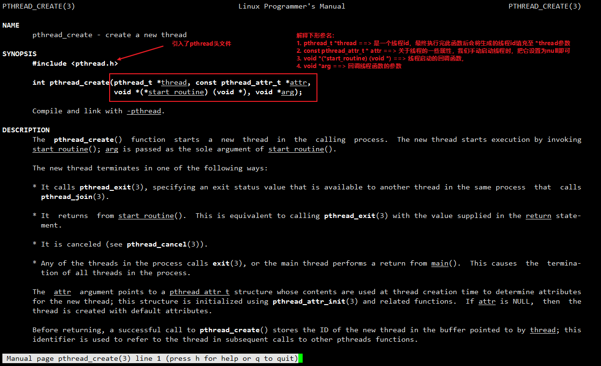
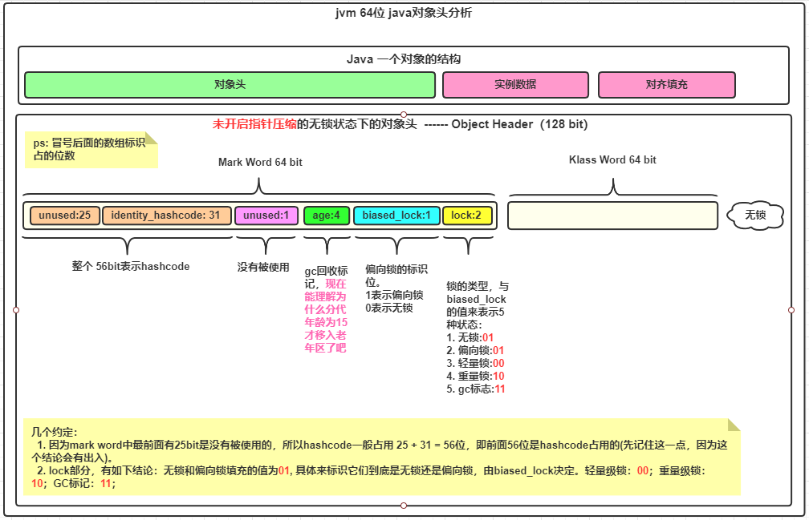
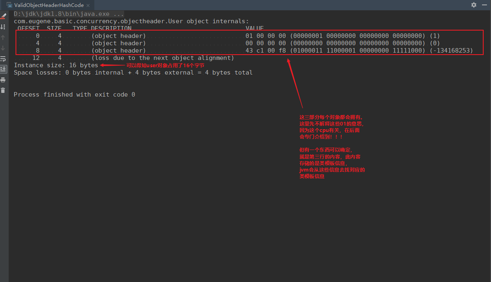
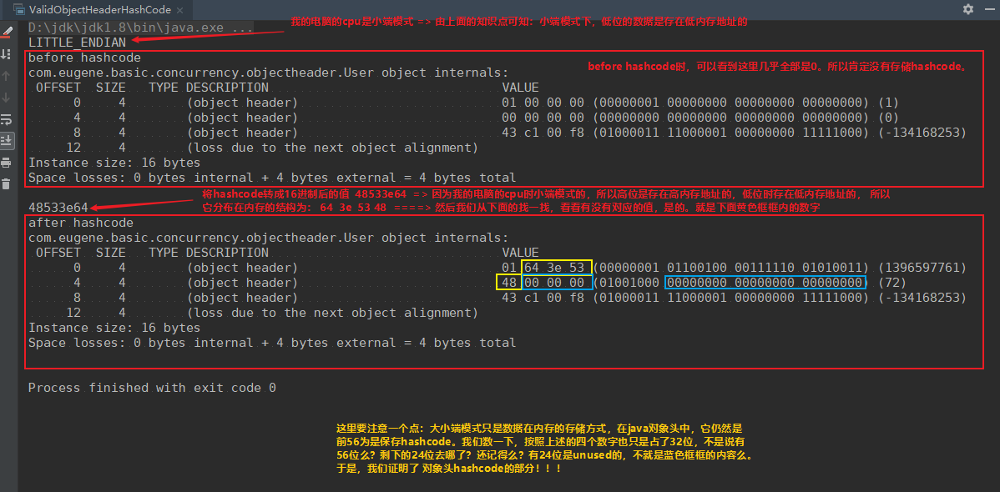
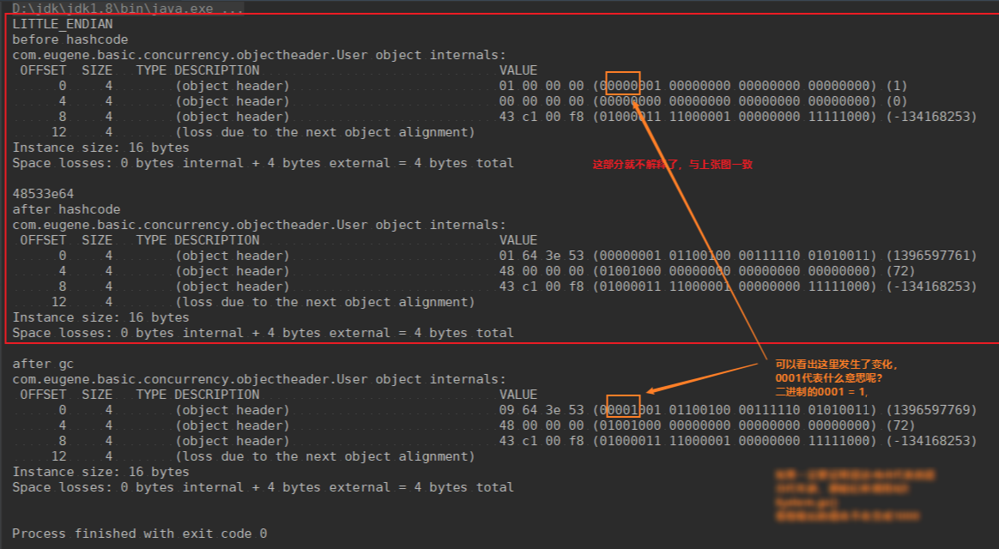
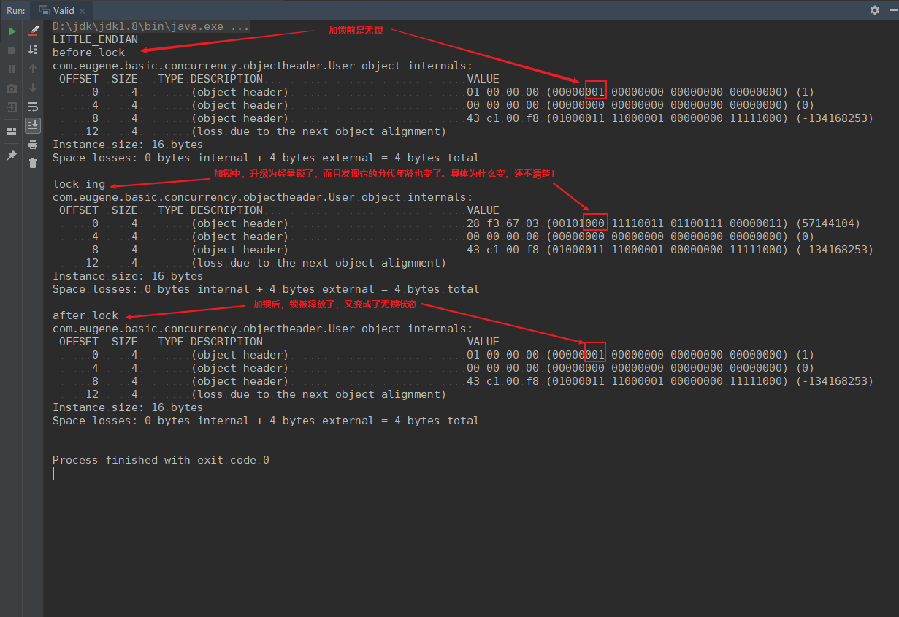
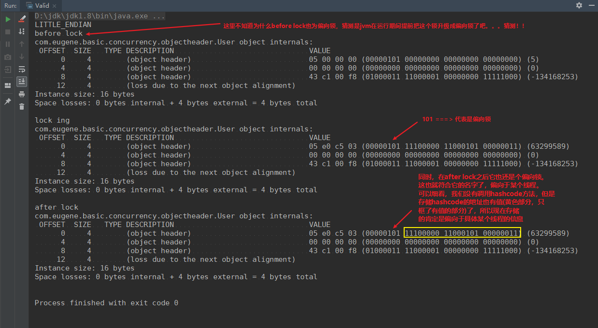
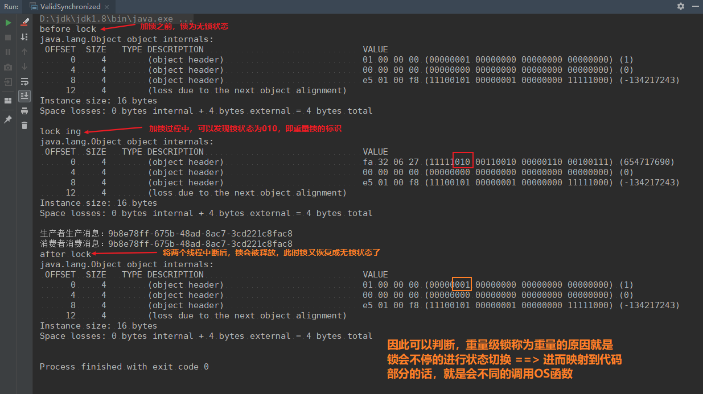
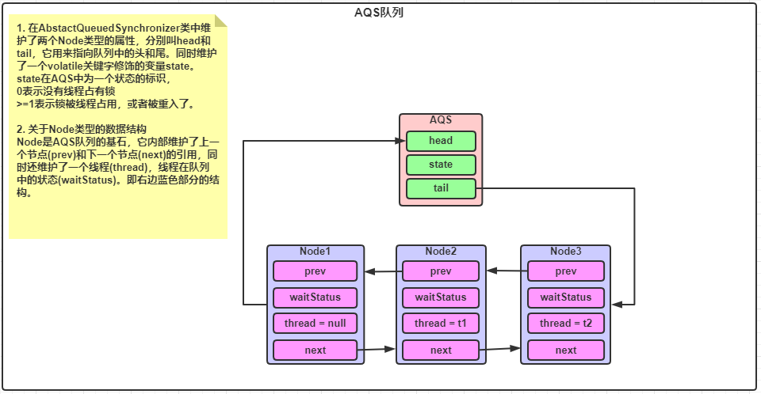
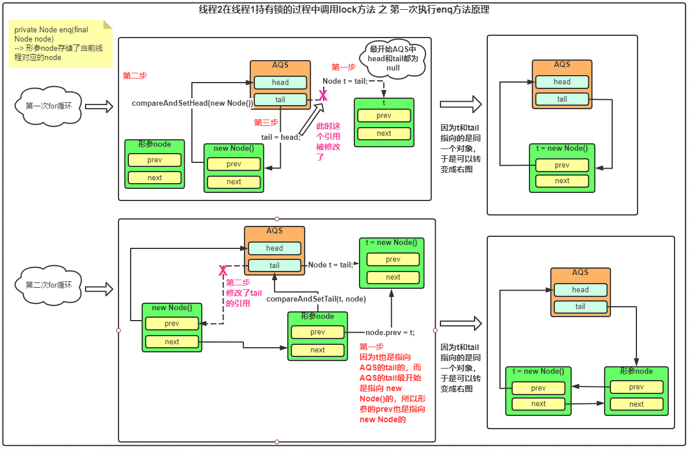

# java并发编程

## 一、java线程与操作系统(centos 7 64位，以下简称centos)的关系

### 1.1 centos os中创建线程的api

* 在centos中，要创建一个线程最终会调用到`pthread_create`方法。于是，我们执行如下命令来查看此方法内容

  ```shell
  #1. 安装man命令 => 为了查看函数信息
  yum install man-pages
  
  #2. 执行如下命令查看具体内容, 具体内容查看下图
  man pthread_create
  ```

  

### 1.2 使用os的api(pthread_create)创建一个线程

* 撰写myThread.c文件

  ```c
  #include "pthread.h" //头文件，在pthread_create方法中有明确写到
  #include "stdio.h"
  
  pthread_t pid; // 定义一个变量，用来存储生成的线程id, 在pthread_create方法中也有介绍
  
  /**
   * 定义主体函数
   */
  void* run(void* arg) {
      while(1) {
         printf("\n Execting run function \n");
         printf(arg);
         sleep(1);
      }
  }
  
  /**
   *  若要编译成可执行文件，则需要写main方法
   */
  int main() {
      pthread_create(&pid, NULL, run, "123"); // 调用os创建线程api
      while(1) { // 这里必须要写个死循环，因为c程序在main方法执行结束后，它内部开的子线程也会关掉
      }
  }
  ```

* 编译c文件成可执行命令

  ```shell
  # -pthread参数表示把pthread类库也添加到编译范围
  gcc -o myThread myThread.c -pthread
  ```

* 运行编译后的c文件

  ```shell
  ./myThread
  ```

* 执行结束后可以发现线程每隔1s就打印`Execting run function` 并输出123

  

  

  那我们要怎么去证明这个是**线程**还是**进程**呢？见下图

  

### 1.3 java中的线程和pthread_create有什么关系？

* 我们可以查看java中**Thread**类的`start`方法

  ```java
  public synchronized void start() {
      // ....... 省略前半部分
      boolean started = false;
      try {
          // *********调用了start0方法*******
          start0();
          started = true;
      } finally {
          // 省略finally中的代码块
      }
  }
  ```

* 我们继续查看`start0`方法

  ```java
  // 它仅仅是一个native修饰的方法，根据我们对jvm的了解，此方法是放在当前线程创建区域中的本地方法栈中
  // 所以它在jvm中肯定有对它的一个实现，但是它是怎么去交互的呢？ 我们目前不知道。。。
  // 按照这样的思路，咱们来创建一个自定义的native方法，然后用java程序去调用
  private native void start0();
  ```

### 1.4 使用java程序调用自己手写的native方法

* 第一步：创建`ExecMyNativeMethod.java`类(不用指定在哪个包下，因为最终要把它放在linux中去执行)

  ```java
  public class ExecMyNativeMethod {
  
      /**
       * 加载本地方法类库，注意这个名字，后面会用到
       */
      static {
          System.loadLibrary("MyNative");
      }
  
      public static void main(String[] args) {
          ExecMyNativeMethod execMyNativeMethod = new ExecMyNativeMethod();
          execMyNativeMethod.start0();
      }
  
      private native void start0();
  }
  ```

* 第二步：将java类编译成class文件

  ```shell
  javac ExecMyNativeMethod.java
  ```

* 第三步：将class文件转成c语言头文件

  ```shell
  javah ExecMyNativeMethod
  ```

* 第四步：我们来大致看一下java文件转成的c语言头文件内容

  ```c
  /* DO NOT EDIT THIS FILE - it is machine generated */
  #include <jni.h>
  /* Header for class ExecMyNativeMethod */
  
  #ifndef _Included_ExecMyNativeMethod
  #define _Included_ExecMyNativeMethod
  #ifdef __cplusplus
  extern "C" {
  #endif
  /*
   * Class:     ExecMyNativeMethod
   * Method:    start0
   * Signature: ()V
   */
  JNIEXPORT void JNICALL Java_ExecMyNativeMethod_start0
    (JNIEnv *, jobject);
  
  #ifdef __cplusplus
  }
  #endif
  #endif
  ```

  对于上述内容，我们只需要关注我们定义的native方法(`JNIEXPORT void JNICALL Java_ExecMyNativeMethod_start0
    (JNIEnv *, jobject);`)即可，也就是说native方法转成c语言头文件后会变成`JNIEXPORT void JNICALL Java_类名_native方法名 (JNIEnv *, jobject);`的格式

* 第五步：更新我们刚刚编写的`myThread.c`文件，为了不造成影响，我们使用cp命令创建出一个新的c文件**myThreadNew.c**

  ```shell
  cp myThread.c myThreadNew.c
  ```

  同时修改**myThreadNew.c**文件为如下内容

  ```c
  #include "pthread.h" // 引用线程的头文件，在pthread_create方法中有明确写到
  #include "stdio.h"
  #include "ExecMyNativeMethod.h" // 将自定义的头文件导入
  
  pthread_t pid; // 定义一个变量，用来存储生成的线程id, 在pthread_create方法中也有介绍
  
  /**
   * 定义主体函数
   */
  void* run(void* arg) {
      while(1) {
         printf("\n Execting run function \n");
         printf(arg);
         sleep(1);
      }
  }
  
  /**
   * 此方法就是后面java要调用到的native方法
   */
  JNIEXPORT void JNICALL Java_ExecMyNativeMethod_start0(JNIEnv *env, jobject c1) {
      pthread_create(&pid, NULL, run, "Creating thread from java application"); // 调用os创建线程api
      while(1) {} // 死循环等待
  }
  
  /**
   * 每个要执行的c文件都要写main方法，
   * 如果要编译成动态链接库，则不需要
   */
  int main() {
      return 0;
  }
  ```

* 第六步：执行如下命令将`myThreadNew.c`文件编译成**动态链接库**，并添加到环境变量中(否则在启动java类的main方法时，在静态代码块中找不到`myNative`类库)

  ```shell
  # 1. 编译成动态链接库
  # 说明下-I后面的参数: 分别指定jdk安装目录的include文件夹和include/linux文件夹
  # 因为我在环境变量中配置了JAVA_HOME，所以我直接世界$JAVA_HOME引用了
  # 后面的libMyNative.so文件，它的格式为lib{xxx}.so
  # 其中{xxx}为类中System.loadLibrary("yyyy")代码中yyyy的值
  gcc -I $JAVA_HOME/include -I $JAVA_HOME/include/linux -fPIC -shared -o libMyNative.so myThreadNew.c
  
  # 2. 将此动态链接库添加到环境变量中
  # 格式: export LD_LIBRARY_PATH=$LD_LIBRARY_PATH:{libxxxx.so}
  # 其中{libxxxxNative.so}为动态链接库的路径, 
  # 我的libMyNative.so文件在/root/workspace文件夹下
  export LD_LIBRARY_PATH=$LD_LIBRARY_PATH:/root/workspace/libMyNative.so
  ```

* 第七步：执行如下命令启动java程序

  ```shell
  java ExecMyNativeMethod
  ```

  运行结果：

  

  **完美！**我们成功的使用java应用程序调用了我们自定义的native方法。可是，我们在用java创建一个线程时，通常是要自己重写run方法，当我们启动线程时，调用的是start方法。刚刚我们证明了，native方法就是会调用到操作系统的一个c文件，如果要调用到run方法，那么我们就必须要通过c来调用到java中的方法。那我们接下来尝试着使用c文件来调用java代码

### 1.5 c语言文件调用java代码

* 第一步：优化我们的`ExecMyNativeMethod.java`类，新增run方法，具体如下：

  ```java
  package com.eugene.basic.thread.myNative;
  
  public class ExecMyNativeMethod {
  
      /**
       * 加载本地方法类库，注意这个名字，后面会用到
       */
      static {
          System.loadLibrary("MyNative");
      }
  
      public static void main(String[] args) {
          ExecMyNativeMethod execMyNativeMethod = new ExecMyNativeMethod();
          execMyNativeMethod.start0();
      }
  
      private native void start0();
  
      public void run() {
          System.out.println("I'm run method..........");
      }
  }
  ```

* 第二步：修改上述的`myThreadNew.c`文件为如下内容(用到了`JNI`，这个c文件在jdk的安装目录中可以找到，所以这是jdk提供的功能)：

  ```c
  #include "stdio.h"
  #include "ExecMyNativeMethod.h" // 将自定义的头文件导入
  #include "jni.h"
  
  /**
   * 此方法就是后面java要调用到的native方法
   */
  JNIEXPORT void JNICALL Java_ExecMyNativeMethod_start0(JNIEnv *env, jobject c1) {
  	jclass cls = (*env)->FindClass(env, "ExecMyNativeMethod");
      if (cls == NULL) {
          printf("Not found class!");
          return;
      }
      
      jmethodID cid = (*env)->GetMethodID(env, cls, "<init>", "()V");
      if (cid == NULL) {
          printf("Not found constructor!");
          return;
      }
      
      jobject obj = (*env)->NewObject(env, cls, cid);
      if (obj == NULL) {
          printf("Init object failed!");
          return;
  	}
      
      jmethodID rid = (*env)->GetMethodID(env, cls, "run", "()V");
      jint ret = (*env)->CallIntMethod(env, obj, rid, NULL);
  	
      printf("Finished!");
  }
  ```

* 第三步：将`myThreadNew.c`文件编译成`动态链接库`

  ```shell
  gcc -I $JAVA_HOME/include -I $JAVA_HOME/include/linux -fPIC -shared -o libMyNative.so myThreadNew.c
  ```

* 第四步：编译java类并执行它

  ```java
  javac ExecMyNativeMethod.java
  java ExecMyNativeMethod
  ```

* 运行结果：

  

  **牛逼！**


## 二、线程基础

### 2.1 java之Synchronized关键字的几种用法即特点

#### 2.1.1 锁类实例和类对象

* 具体参考如下代码：

  ```java
  // 情况一：锁object对象
  public class Demo {
  
      private Object object = new Object();
  
      public void test(){
          synchronized (object) {
              System.out.println(Thread.currentThread().getName());
          }
      }
  }
  
  // 情况二: 锁当前对象 this，锁定某个代码块
  // 使用此种方式要注意调用进来的this是否为同一对象
  // 若Demo的实例不是单例的，那么这把锁基本上起不到同步的作用
  public class Demo {
  
      public void test() {
          //synchronized(this)锁定的是当前类的实例,这里锁定的是Demo2类的实例
          synchronized (this) {
              System.out.println(Thread.currentThread().getName());
          }
      }
  }
  
  // 情况三: 锁当前对象 this，锁定整个方法
  // 与情况二类似，但是它是锁住了整个方法，粒度比情况二大
  public class Demo {
  
      public synchronized void test() {
          System.out.println(Thread.currentThread().getName());
      }
  }
  
  
  // 情况四: 锁类对象，粒度最大，
  // ===> 当调用当前类的所有同步静态方法将会等待获取锁
  // 注意: 但是此时还是能调用类实例的同步方法。为什么呢？
  // 因为静态同步方法和类实例同步方法拥有的锁不一样
  // 一个是类对象一个是类实例对象。
  // 同时，此时还能调用类对象的静态非同步方法以及类实例的
  // 非同步方法。为什么呢？因为这些方法没有加锁啊，可以直接调用。
  
  public class Demo {
  
      public static synchronized void test() {
          System.out.println(Thread.currentThread().getName());
      }
  }
  ```

#### 2.1.2 锁同一个String常量

* 查看如下代码：

  ```java
  /**
    上面说了，synchronized关键字锁的是对象，
    而对于s1和s2这两个对象，他们的值都是lock，
    也就是放在常量池中的(堆内的方法区)，
    所以s1和s2指向的是同一个对象。所以
    下面的test1和test2方法使用的都是同一把锁，
    最终的运行结果就是线程2会等待线程1把锁释放完毕后
    才能获取锁并执行如下代码。
   */
  public class Demo {
  
      String s1 = "lock";
      String s2 = "lock";
  
      public void test1() {
          synchronized (s1) {
              System.out.println("t1 start...");
              try {
                  TimeUnit.SECONDS.sleep(2);
              } catch (InterruptedException e) {
                  e.printStackTrace();
              }
              System.out.println("t1 end...");
          }
      }
  
      public void test2() {
          synchronized (s2) {
              System.out.println("t2 start...");
          }
      }
  
      public static void main(String[] args) {
          Demo demo = new Demo();
          new Thread(demo :: test1, "test1").start();
          new Thread(demo :: test2, "test2").start();
      }
  
  }
  ```

#### 2.1.3 拥有线程安全的一段代码

* 代码如下：

  ```java
  /**
   多个线程同时对count进行减减操作，
   会出现线程安全的问题(运行的结果不一定，因为所有的线程会由cpu的调度来决定)，
   假设线程1对count减减了，但是此时还没有进行输出，线程2和线程3都对count进行
   了减减操作，此时线程1的打印数据中，count就会变成7，
   为了解决这个问题，可以使用synchronized关键字加锁。
   
   这里还要注意，此段代码在执行的过程中，每个线程都会将count拷贝到它自己的工作
   内存中去，所以他们操作的都是自己内存中的值，在这期间有可能线程修改完状态后
   就去通知了主内存，让他同步一下修改后的值，同时主内存会通知其他的线程，让他们
   读取这个变量时，从主内存中去读。 这里要注意，上面说的是 "有可能线程修改完状态后
   就去通知了主内存"。这个是不确定的，如果一定要保证这样的一个逻辑的话，
   可以对方法添加synchronized关键字，此关键字可以保证安全以及将上面的有可能去掉，
   最终就一定会是：线程修改完状态后就去通知主内存。所以synchronized关键字
   也具有"可见性"(可见性后面会说)
   */
  public class Demo implements Runnable {
  
      private int count = 10;
  
      @Override
      public /*synchronized*/ void run() {
          count--;
          System.out.println(Thread.currentThread().getName() + " count = " + count);
      }
  
      public static void main(String[] args) {
          Demo demo = new Demo();
          for (int i = 0; i < 5; i++) {
              new Thread(demo, "thread-" + i).start();
          }
      }
  
  }
  ```

#### 2.1.4  可重入性(包括继承)

* 概念解释：**所谓可重入性就是在有锁的方法内调用另一个加锁的方法**

* 见如下代码

  ```java
  /**
   一个同步方法调用另外一个同步方法，支持可重入
   */
  public class Demo {
  
      public synchronized void test1() {
          System.out.println("test1 start.........");
          try {
              TimeUnit.SECONDS.sleep(1);
          } catch (InterruptedException e) {
              e.printStackTrace();
          }
          test2();
      }
  
      public synchronized void test2() {
          System.out.println("test2 start.......");
      }
  
      public static void main(String[] args) {
          Demo demo = new Demo();
          demo.test1();
      }
  
  }
  
  /**
   继承也支持可重入特性
   */
  public class Demo {
  
      synchronized void test() {
          System.out.println("demo1 test start........");
          try {
              TimeUnit.SECONDS.sleep(1);
          } catch (InterruptedException e) {
              e.printStackTrace();
          }
          System.out.println("demo1 test end........");
      }
  
      public static void main(String[] args) {
          new Demo2().test();
      }
  
  }
  
  class Demo2 extends Demo {
  
      @Override
      synchronized void test() {
          System.out.println("demo2 test start........");
          // 此处调用了父类的方法
          super.test();
          System.out.println("demo2 test end........");
      }
  
  }
  ```

#### 2.1.5 Synchronized释放锁的几种情况

* Synchronized关键字是**手动上锁自动释放锁**的。同时自动释放锁包括：`加锁代码块执行结束或者抛出的异常`
* 同时，在执行await方法时，锁会被自动释放。

#### 2.1.6 特点总结

* 具有可重入性、可见性、原子性。


### 2.2 API之wait/notify/notifyAll

* wait、notify、notifyAll要和锁一起搭配使用，同时notify的作用是唤醒某个阻塞中的线程，这个线程是随机的，由cpu的调度决定

#### 2.2.1 使用wait、notify实现一个生产者一个消费者问题

* 使用wait和notify实现一个消息队列，生产者1秒生产一个消息,当队列的元素达到10个时，生产者停止生产，通知消费者消费消息

  ```java
  public class Index1 {
  
      private LinkedList<Message> linkedList = new LinkedList<>();
  
      private static Object lock = new Object();
  
      public static void main(String[] args) {
          Index1 index1 = new Index1();
  
          new Thread(() -> {
  
              while (true) {
                  synchronized (lock) {
                      if (index1.linkedList.size() <= 0) {
                          try {
                              // 通知生产者继续生产
                              lock.notify();
                              // 这里有个知识点：
                              // 当调用lock的wait方法时，当前线程会
                              // 释放lock这把锁
                              lock.wait();
  
                          } catch (InterruptedException e) {
                              e.printStackTrace();
                          }
                      }
  
                      Message message = index1.linkedList.pollLast();
                      System.out.println("消费消息： " + message.content);
                  }
              }
  
          }, "消费者").start();
  
  
          new Thread(() -> {
              while (true) {
                  synchronized (lock) {
                      if (index1.linkedList.size() == 10) {
                          try {
                              System.out.println("生产者生产消息达到10条，开始通知消费者消费");
                              lock.notify();
  
                              // 自己等待，释放这把锁让消费者拥有锁，停止自己的生产
                              lock.wait();
                          } catch (InterruptedException e) {
                              e.printStackTrace();
                          }
                      }
  
                      try {
                          TimeUnit.SECONDS.sleep(1);
                      } catch (InterruptedException e) {
                          e.printStackTrace();
                      }
  
                      Message message = new Message(UUID.randomUUID().toString());
                      index1.linkedList.addFirst(message);
                      System.out.println("生产者生产消息： " + message.content);
                  }
  
              }
          }, "生产者").start();
      }
  }
  
  class Message {
      String content;
  
      public Message(String context) {
          this.content = context;
      }
  }
  ```

#### 2.2.2 使用wait和notifyAll实现生产者和消费者问题

* 2个生产者消费消息，5个消费者抢消息进行消费

  ```java
  // 2个生产者消费消息，5个消费者抢消息进行消费
  public class Index2 {
  
      private static LinkedList<Message> linkedList = new LinkedList<>();
  
      private static Object consumerLock = new Object();
  
      private static Object producerLock = new Object();
  
      public static void main(String[] args) {
          for (int i = 0; i < 5; i++) {
              new Thread(() -> {
                  while (true) {
                      synchronized (consumerLock) {
                          if (linkedList.size() <= 0) {
                              continue;
                          }
  
                          Message first = linkedList.pollLast();
                          System.out.println(Thread.currentThread().getName() + "消费消息" + first.content);
                      }
                  }
              }, "消费者-" + i).start();
          }
  
          for (int i = 0; i < 2; i++) {
              new Thread(() -> {
                  while (true) {
                      synchronized (producerLock) {
                          producerLock.notify();
                          try {
                              TimeUnit.SECONDS.sleep(1);
                          } catch (InterruptedException e) {
                              e.printStackTrace();
                          }
                          Message message = new Message(UUID.randomUUID().toString());
                          linkedList.addFirst(message);
                          System.out.println(Thread.currentThread().getName() + "生产消息" + message.content);
                          try {
                              producerLock.wait();
                          } catch (InterruptedException e) {
                              e.printStackTrace();
                          }
                      }
                  }
              }, "生产者-" + i).start();
          }
      }
  }
  ```

#### 2.2.3 写一个同步容器,支持两个生产者线程以及10个消费者线程的阻塞调用

* 写一个同步容器，拥有Put和get方法，以及getCount方法，能够支持两个生产者线程以及10个消费者线程的阻塞调用

  ---> 阻塞调用的含义：当消费者调用get方法时，若里面没有值则阻塞在那里，直到有值后再获取

* **使用jdk自带的wait和notify方式实现**

  ```java
  public class Container<T> {
  
      private LinkedList<T> linkedList = new LinkedList<>();
  
      public synchronized void put(T t) {
          this.notifyAll();
          linkedList.addFirst(t);
      }
  
      /**
       * get这里会出现阻塞调用的情况，
       * 如果长度为0时，则等待生产者往里面生成东西
       * @return
       */
      public synchronized T get() {
          while (this.getCount() == 0) {
              try {
                  System.out.println(Thread.currentThread().getName() + "调用get方法时，无消息可拿取，等待中…………");
                  this.wait();
              } catch (InterruptedException e) {
                  e.printStackTrace();
              }
          }
          return linkedList.pollFirst();
      }
  
      public synchronized int getCount() {
          return linkedList.size();
      }
  
  
      public static void main(String[] args) {
          Container<String> container = new Container<>();
  
          for (int i = 0; i < 2; i++) {
              new Thread(() -> {
                  String val = UUID.randomUUID().toString();
                  container.put(val);
                  System.out.println(Thread.currentThread().getName() + "生产消息：" + val);
              }, "生产者-" + i).start();
          }
  
          for (int i = 0; i < 10; i++) {
              new Thread(() -> {
                  String val = container.get();
  
                  System.out.println(Thread.currentThread().getName() + "消费消息：" + val);
              }, "消费者-" + i).start();
          }
      }
  
  }
  ```

* **使用ReentryLock的Condition实现**

  ```java
  // 代码 TODO
  ```

### 2.3 创建线程的几种方式

* 详见如下表格：

  |     方式类别     |                             特点                             |
  | :--------------: | :----------------------------------------------------------: |
  |   继承Thread类   |              java是单继承的，一般不推荐此种方式              |
  | 实现Runnable接口 |            java支持实现多个接口，一般使用此种方式            |
  | 使用FutureTask类 | 与Runnable的实现方式差不多，都要将对应的实例传入Thread对象中去，但它能获取到线程执行结果的返回值 |

### 2.4 线程的几个常用api汇总

* 详见如下表格：

  |      api      |                             特点                             |                             备注                             |
  | :-----------: | :----------------------------------------------------------: | :----------------------------------------------------------: |
  |     stop      | 暴力停止线程，jvm不推荐此种方式，而且此api将在后面的jdk中被抛弃。 |                              无                              |
  |     yield     |                   当前线程让出cpu的使用权                    |      此方法为Thread的类方法，底层调用了原生的yield方法       |
  |   interrupt   | 停止线程的优雅方式，jvm认为就算要停止线程也应该要执行线程停止后的业务逻辑，比如关闭某些连接资源。此方式只是标识了线程的状态为interrupt | 实例方法。`若线程处于sleep状态，抛出InterruptedException后，又会将interrupt状态给置为false` |
  | isInterrupted |               判断当前线程是否为interrupt状态                |                           实例方法                           |
  |  interrupted  |     判断当前线程是否为interrupt状态，并清除interrupt状态     |                            类方法                            |
  |     sleep     |   将当前线程睡眠一段时间，此方法会抛出InterruptedException   |                            类方法                            |
  |     wait      | 此方法为object类的方法，一般作用于锁对象上，也就是说假设有一个锁为Object lock = new Object(); 那么一般是调用lock.wait(); 此方法可以让当前线程处于阻塞状态 |                              无                              |
  |    notify     | 与wait成对出现，一般也是使用锁对象的notify方法，因为这样才能具体的通知到使用同一个锁对象的wait方法而进入阻塞状态的线程。 | notify具有唤醒一个线程的功能，具体唤醒哪个线程由cpu决定(所谓的唤醒就是把线程放在可以竞争cpu资源的队列中去，在JVM源码中，是一个叫entry_list的队列) |
  |   notifyAll   |                 与wait成对出现，与notify类似                 | notifyAll唤醒的是所有wait状态下的线程(即将所有的线程放在竞争cpu资源的队列中去，最终仅仅是只有一个线程被唤醒调用)  --> 因为notify和notifyAll会结合wait一起使用，而他们会结合synchronized关键字一起使用，`因此可以证明，synchronized是非公平锁` |
  |    suspend    |                           暂停线程                           |                          不会释放锁                          |
  |    resume     |                 恢复线程，与suspend配套使用                  |                              无                              |
  |     join      | 优先执行指定线程，eg：在线程t2中调用线程t1.join()方法，那么t2会让出cpu的调度权，让t1先执行 |                              无                              |

### 2.3 线程状态转换图

* 

### 2.4 如何优雅的终止一个线程

* 首先咱们要理解线程处于阻塞状态的情况，在这里只考虑如下两种情况

  ```java
  /**
    情况一：
      run方法内部执行逻辑是使用while + 一个布尔变量来控制逻辑的
      此种方法，我们可以通过修改flag变量来达到终止线程的目的。
      但是这种情况有一种缺陷，就是假如我在循环体内睡眠了10s，然后
      主线程在3s的时候把flag设置为false了。当我们把flag设置为false时，
      其实是想让线程立马终止的，但是按照这样的一个逻辑的话，它并不会立马
      终止，反而会再睡眠7s钟后执行后面的System.out.println("runing");
      代码。
      
      所以我们直接使用flag的方式达不到立即终止线程的阻塞状态
    */
  static flag = true;
  public static void main(String[] args) {
      MyThread t = new MyThread();
      t.start();
  }
  
  private static class MyThread extends Thread {
      public void run() {
          while(flag) {
              try {
                  Thread.sleep(10000);
              } catch (InterruptedException e) {
                  e.printStackTrace();
              }
              System.out.println("runing");   
          }
      }
  }
  
  /**
    情况二：
      我们的目的是直接让线程停止，那我们直接调用它的stop方法不就行了吗？
      如下述main方法所述。
  	
  	emmm, 我想说这样的确能达到目的，但是jvm不推荐这么停止一个线程，
  	而且stop方法在后续的jdk版本中可能会被抛弃。为什么不推荐呢？
  	我们假设这么一个场景，我们要不停的读取一个文件，所以要在while
  	循环体中打开一个文件流，假设还未执行到关闭流的代码部分，主线程
  	就调用到了stop方法，那这不就造成资源浪费了嘛
   */
  public static void main(String[] args) {
  	t.stop();
  }
  ```

  总而言之：**jvm不希望直接停止一个线程，而是希望线程要执行结束。**那么我们要如何解决上述的情况二呢？我们可以使用`interrupt()`方法，假设一个线程执行此方法时，它会抛出`InterruptedException`异常(实际上是将线程标识成了**interrupt**状态，此时如果线程在执行过程中，发现它是处于**interrupt**状态，于是抛出了`InterruptedException`异常)，此时我们可以截取到这个异常然后执行一些`关闭资源`类似的操作


## 三、java对象头

### 3.1 对象头结构

* 详见无锁状态下的对象信息

  

* 详见其他几种状态下的对象信息（**偏向锁、轻量锁、重量锁、GC标识**）
  

### 3.2 使用JOL查看对象头信息

* 第一步：创建**User.java**类

  ```java
  package com.eugene.basic.concurrency.objectheader;
  
  public class User {
  }
  ```

* 第二步：使用JOL API查看user对象的布局信息

  ```java
  package com.eugene.basic.concurrency.objectheader;
  
  import org.openjdk.jol.info.ClassLayout;
  
  /**
   * 验证对象头hashCode信息
   */
  public class Valid {
  
      public static void main(String[] args) {
          User user = new User();
          System.out.println(ClassLayout.parseInstance(user).toPrintable());
      }
  }
  ```

* 运行结果如下图所示：

  

### 3.3 证明无锁状态下的对象头的前56位为hashcode

#### 3.3.1 cpu的大小端模式

* 为什么要总结这个呢？因为jol打印出来的一些对象信息里面有很多0101以及对应的十六进制的值。我们要知道hashcode存在哪，就要知道cpu的大小端模式。

#### 3.3.2 何为大小端模式

* 参考链接：[https://www.cnblogs.com/0YHT0/p/3403474.html](https://www.cnblogs.com/0YHT0/p/3403474.html)。大致总结为：**我们的数据是存在内存中的，而每个cpu对应的存储方式是不一致的。**所谓大端模式就是高位存在内存低位上，eg：假设要存储12345678这个数字时，8属于个位、7属于十位.....以此类推。那么，我们就能知道1是最高位，所以它会被存到内存的低位。拿上述链接的总结来说就是如下表所示：

  |  内存地址  | 存储的数据（Byte） |
  | :--------: | :----------------: |
  | 0x00000000 |        0x12        |
  | 0x00000001 |        0x34        |
  | 0x00000002 |        0x56        |
  | 0x00000003 |        0x78        |

  大致意思就是这样。小端模式的话，相反的。这里就不总结了。那么问题来了，我们如何知道我们的cpu是大端存储模式还是小端存储模式呢？java提供了如下api：

  ```java
  // 输出结果参考如下内容：
  // BIG_ENDIAN：大端模式
  // LITTLE_ENDIAN: 小端模式
  System.out.println(ByteOrder.nativeOrder().toString());
  ```

#### 3.3.3 证明hashcode

* 接下来我们来证明前56位存储的hashcode。

* 新建如下类

  ```java
  public class Valid {
  
      public static void main(String[] args) {
          System.out.println(ByteOrder.nativeOrder().toString());
  
          User user = new User();
          System.out.println("before hashcode");
          System.out.println(ClassLayout.parseInstance(user).toPrintable());
          // 将hashcode转成16进制，因为jol在输出的内容中包含16进制的值
          System.out.println(Integer.toHexString(user.hashCode()));
  
          System.out.println("after hashcode");
          System.out.println(ClassLayout.parseInstance(user).toPrintable());
  
      }
  }
  ```

* 运行结果如下：

  

### 3.4 证明mark word中的后8为分别存了锁信息、分代年龄

#### 3.4.1 证明分代年龄

* 针对上述代码做部分修改，得到如下代码：

  ```java
  public class Valid {
  
      public static void main(String[] args) {
          System.out.println(ByteOrder.nativeOrder().toString());
  
          User user = new User();
          System.out.println("before hashcode");
          System.out.println(ClassLayout.parseInstance(user).toPrintable());
          // 将hashcode转成16进制，因为jol在输出的内容中包含16进制的值
          System.out.println(Integer.toHexString(user.hashCode()));
  
          System.out.println("after hashcode");
          System.out.println(ClassLayout.parseInstance(user).toPrintable());
  
          System.out.println("after gc");
          System.gc();
          System.out.println(ClassLayout.parseInstance(user).toPrintable());
  
      }
  }
  ```

* 运行后的结果及分析如下：

  

#### 3.4.2 证明无锁

* 利用[3.1.4 证明分代年龄](####3.4.1 证明分代年龄)部分的图说明即可。可以看到黄色框框部分的后三位为`001`。`001`则表示为无锁，可参考[上述对象头结构图](###3.1 对象头结构)

#### 3.4.3 证明轻量锁

* 先解释下什么叫轻量锁：

  ```txt
  所谓轻量锁：有锁竞争，但不是那种频繁的竞争，一般为多个线程交替执行，不会涉及到锁资源的竞争
  ```

* 修改代码为如下内容：

  ```java
  public class Valid {
  
      public static void main(String[] args) {
          System.out.println(ByteOrder.nativeOrder().toString());
  
          User user = new User();
          System.out.println("before lock");
          System.out.println(ClassLayout.parseInstance(user).toPrintable());
  
          synchronized (user) {
              System.out.println("lock ing");
              System.out.println(ClassLayout.parseInstance(user).toPrintable());
          }
  
          System.out.println("after lock");
          System.out.println(ClassLayout.parseInstance(user).toPrintable());
      }
  }
  ```

* 运行结果即分析如下：

  

#### 3.4.4 证明偏向锁

* 偏向锁概念：**当只有单个线程执行加锁代码段时，此时的锁为偏向锁，即偏向于当前线程**

* 其实吧，讲道理在[3.4.3 证明轻量锁](####3.4.3 证明轻量锁)中它应该是一把偏向锁，为什么呢？`因为只有一个线程在占用这把锁，当前偏向于这个线程呀`。是的，也没理解错。那为什么会出现这种情况呢？因为jvm在启动项目时做了一个优化！**jvm把偏向锁的功能延迟了4s钟**，即在jvm启动4s后再开始启用偏向锁。我们来证明下

* 修改valid.java为如下代码：

  ```java
  public class Valid {
  
      public static void main(String[] args) throws InterruptedException {
          // 这里要注意, 一定要在创建对象之前睡眠，若我们先创建对象，可以想一想会发生什么情况！
          // 那肯定是不会启动偏向锁的功能呀，我们都知道加锁其实是给对象加了个标识
          // 如果我们在偏向锁功能未开启之前创建了对象，很抱歉，
          // jvm没有那么智能，后面不会去把这个对象改成可偏向状态(是偏向锁，但是没有偏向具体
          // 的线程)
          Thread.sleep(4100);
          
          System.out.println(ByteOrder.nativeOrder().toString());
          User user = new User();
          System.out.println("before lock");
          System.out.println(ClassLayout.parseInstance(user).toPrintable());
  
          synchronized (user) {
              System.out.println("lock ing");
              System.out.println(ClassLayout.parseInstance(user).toPrintable());
          }
  
          System.out.println("after lock");
          System.out.println(ClassLayout.parseInstance(user).toPrintable());
      }
  }
  ```

* 运行结果与分析如下：

  

  **之前说过，偏向锁和hashcode是互斥的，大家可以在加锁之前调用hashcode，就会发现它不会变成偏向锁了！而且在第一次打印这个对象头信息时，发现它是一个偏向锁。但是！`它也仅仅是一个偏向锁,并没有具体偏向哪一个线程，此时可以趁这把锁处于可偏向状态`**

#### 3.4.5 证明偏向锁的重偏向

* 若一把锁是偏向锁，且偏向的是线程A。当线程A执行完加锁代码块后，线程B此时去申请拿这把锁，那么这把锁肯定会升级为轻量锁。但是有一个意外的情况，jvm认为：当重复将同一类型的锁(`假设这个锁的类型同时为Object类型`)升级为轻量锁时，若次数超过了`20(可以添加jvm参数查看: -XX:+PrintFlagsFinal)`，此时jvm就会将后面的锁对象进行`重偏向操作`，即把后面所有的锁都改成偏向锁，不做这个偏向锁升级为轻量锁的过程了。

* 接下来开始证明，新增如下类`ReBiasedLock.java`

  ```java
  public class ReBiasedLock {
  
      static List<User> locks = new ArrayList<>();
  
      static final int THREAD_COUNT = 20;
  
      public static void main(String[] args) throws InterruptedException {
          // 延迟4.1秒，等待jvm偏向锁功能开启
          Thread.sleep(4300);
  
          Thread t1 = new Thread(() -> {
              for (int i = 0; i < THREAD_COUNT; i++) {
                  User lock = new User();
                  locks.add(lock);
                  synchronized (lock) {
                      System.out.println("线程1 第 " + i + " 把锁");
                      System.out.println(ClassLayout.parseInstance(lock).toPrintable());
                      System.out.println("\n *********************************** \n");
                  }
  
              }
          }, "线程1");
  
          t1.start();
          // 等t1执行完
          t1.join();
  
          new Thread(() -> {
              for (int i = 0; i < locks.size(); i++) {
                  User lock = locks.get(i);
                  synchronized (lock) {
                      System.out.println("线程2 第 " + i + " 把锁");
                      System.out.println(ClassLayout.parseInstance(lock).toPrintable());
                      System.out.println("\n ==================================== \n");
                  }
              }
          }, "线程1").start();
  
      }
  }
  ```

* 运行结果与分析：

  > 1.当THREAD_COUNT设置为19时，线程2打印出来的所有锁信息都为轻量锁(**同时要注意偏向的线程有没有变化**)。
  > 2.当THREAD_COUNT设置为20时，线程2打印出来的所有锁信息都为偏向锁(**同时要注意偏向的线程有没有变化**)。

* **`说明：在本案例中，使用的是User类(空对象，没有手动添加任何属性)作为锁的阈值是20，但是我把类型换成Object的话，它的阈值并不是20。所以这块还需要确认这个阈值是不是要按照某种算法算出来的！`**

#### 3.4.6 证明重撤销(重轻量)

* 所谓重撤销、重轻量是指：若同一类型的锁升级轻量锁的次数达到了40，此时就会将后面的锁都批量撤销为无锁状态，并膨胀到轻量锁

* 具体查看如下java类：

  ```java
  public class ReLightweightLock {
  
      static List<User> users = new ArrayList<>();
  
      public static void main(String[] args) throws InterruptedException {
          System.out.println("Starting");
  
          // 延迟加载，让jvm开启偏向锁功能
          Thread.sleep(4400);
  
          Thread t1 = new Thread(() -> {
              for (int i = 0; i < 100; i++) {
                  User lock = new User();
                  users.add(lock);
                  synchronized (lock) {
                      if (i == 22) {
                          System.out.println("t1 i = " + i + "\t" + ClassLayout.parseInstance(lock).toPrintable());
                      }
                  }
              }
          });
          t1.start();
          t1.join();
  
          // 打印第88个，已经是偏向锁了
          System.out.println("i = 88 \t" + ClassLayout.parseInstance(users.get(88)).toPrintable());
  
          // 创建一个新线程睡眠2s，保证下面的代码先执行，保证重偏向时，不会出现线程ID重复的情况
          new Thread(() -> {
              try {
                  Thread.sleep(2000);
              } catch (InterruptedException e) {
                  e.printStackTrace();
              }
          }).start();
  
          Thread t2 = new Thread(() -> {
              for (int i = 0; i < users.size(); i++) {
                  User lock = users.get(i);
                  synchronized (lock) {
                      if (i == 10 || i == 21) {
                          // 输出第10和21个，看看分别是不是轻量锁和偏向锁
                          System.out.println("t2 i = " + i + "\t" + ClassLayout.parseInstance(lock).toPrintable());
                      }
                  }
              }
          });
          t2.start();
          t2.join();
  
          // 查看第10个锁对象，看看是不是20之前的锁也被重偏向了  --> 结果证明，只会对20以后的锁重偏向
          System.out.println("i = 10\t" + ClassLayout.parseInstance(users.get(10)).toPrintable());
  
          // 查看第89个锁对象，看看是不是被批量重偏向了  --> 结果证明：是的
          System.out.println("i = 88\t" + ClassLayout.parseInstance(users.get(88)).toPrintable());
  
          // 创建一个新线程睡眠2s，保证下面的代码先执行，保证重偏向时，不会出现线程ID重复的情况
          new Thread(() -> {
              try {
                  Thread.sleep(2000);
              } catch (InterruptedException e) {
                  e.printStackTrace();
              }
          }).start();
  
          Thread t3 = new Thread(() -> {
              for (int i = 0; i < users.size(); i++) {
                  User lock = users.get(i);
                  synchronized (lock) {
                      if (i == 10 || i == 21) {
                          // 输出第10和21个，看看是不是都为轻量锁
                          // ---> 结果证明：都为轻量锁
                          // i == 10为轻量锁，我们都能理解，因为偏向锁被其他线程持有了，当然膨胀为轻量锁了
                          // 可是i == 21不应该为偏向锁么？因为进行重偏向了
                          // 这里不是重偏向了，因为user类型的锁升级为轻量锁的次数达到了40，所以jvm直接
                          // 做了重撤销或者说重轻量的操作，把后面所有的锁都变成轻量锁了
                          // 又因为前面20次本来就是轻量锁，所以此时整个100个user对象都是轻量锁
                          System.out.println("t3 i = " + i + "\t" + ClassLayout.parseInstance(lock).toPrintable());
                      }
                  }
              }
          });
          t3.start();
          t3.join();
      }
  }
  ```

  

#### 3.4.7 证明重量锁

* 重量锁概念：**重量锁会存在多个线程抢占锁资源**。所以我们写一个生产者消费者案例来证明

* 添加如下类：

  ```java
  public class ValidSynchronized {
  
      static Object lock = new Object();
  
      static volatile LinkedList<String> queue = new LinkedList<>();
  
      public static void main(String[] args) throws InterruptedException {
          System.out.println("before lock");
          System.out.println(ClassLayout.parseInstance(lock).toPrintable());
  
          Consumer consumer = new Consumer();
          Producer producer = new Producer();
  
          consumer.start();
          producer.start();
  
          Thread.sleep(500);
          consumer.interrupt();
          producer.interrupt();
  
          // 睡眠0.5s ==> 目的是为了让锁自己释放，防止在释放过程中打印锁的状态出现重量锁的情况
          Thread.sleep(500);
          System.out.println("after lock");
          System.out.println(ClassLayout.parseInstance(lock).toPrintable());
      }
  }
  
  class Producer extends Thread {
  
      @Override
      public void run() {
          while (!isInterrupted()) {
              synchronized (ValidSynchronized.lock) {
                  System.out.println("lock ing");
                  System.out.println(ClassLayout.parseInstance(ValidSynchronized.lock).toPrintable());
                  String message = UUID.randomUUID().toString();
                  System.out.println("生产者生产消息：" + message);
                  ValidSynchronized.queue.offer(message);
                  try {
                      // 生产者自己wait，目的是释放锁
                      ValidSynchronized.lock.notify();
                      ValidSynchronized.lock.wait();
                      TimeUnit.SECONDS.sleep(1);
                  } catch (InterruptedException e) {
                      this.interrupt();
                  }
              }
          }
      }
  }
  
  class Consumer extends Thread {
  
      @Override
      public void run() {
          while (!isInterrupted()) {
              synchronized (ValidSynchronized.lock) {
                  if (ValidSynchronized.queue.size() == 0) {
                      try {
                          ValidSynchronized.lock.wait();
                          ValidSynchronized.lock.notify();
                      } catch (InterruptedException e) {
                          e.printStackTrace();
                      }
                  }
                  String message = ValidSynchronized.queue.pollLast();
                  System.out.println("消费者消费消息：" + message);
  
                  try {
                      TimeUnit.SECONDS.sleep(1);
                  } catch (InterruptedException e) {
                      this.interrupt();
                  }
              }
          }
      }
  }
  ```

* 运行结果及分析：

  

#### 3.4.8 证明后得出的几个结论

* **偏向锁和hashcode是互斥的，只能存在一个**。

* **jvm默认对偏向锁功能是延迟加载的，大概时间为4s钟**，可以添加JVM参数： `-XX:BiasedLockingStartupDelay=0`来设置延迟时间。

* **偏向锁退出同步块后依然也是偏向锁**

* **重量级锁之所以重量就是因为状态不停的切换，最终映射到代码层面就是不停的调用操作系统函数(最终会调用到jvm的`mutex`类)**

* **额外的几个知识点：**

  > 1.调用锁对象的wait方法时，当前锁对象会立马升级为**重量级锁**
  >
  > 2.偏向锁的延迟加载关闭后，基本上所有的锁都会为**可偏向状态**，即mark word为101，但是它还没有具体偏向的线程信息
  >
  > 3.偏向锁只要被其他线程拿到了，此时偏向锁会膨胀。膨胀为**轻量锁**。

#### 3.4.9 总结synchronized关键字原理

* Synchronized关键字的实现原理是：当jvm把java类编译成class字节码文件时，会为synchronized关键字添加一个**monitorenter**和**monitorexit**指令，这个指令为jvm的一个规范，具体的实现由具体的虚拟机去实现(**eg: hotspot，jrockit, j9等等**)，在hotspot中，此执行在底层对应的是一个叫moniter的对象，内部维护了一个**wait_list和entry_list**(只有在这个队列中的线程才有资格竞争cpt资源)，当我们在调用锁对象的wait方法时，会将当前线程放入wait_list中去，当调用notify时，会从wait_list中随机找出一个线程放入entry_list中去，当调用notifyAll方法时，会将wait_list中所有的线程都放入到entry_list中，再由cpu来随机调度，因此它是一个**非公平锁**。同时，在jdk1.6之前，**monitorenter**和**monitorexit**指令在底层对应的实现就是调用os系统的函数(**mutex中的函数**)，因此它是一个重量级锁。而在jdk 1.6之后，jvm对synchronized关键字进行了优化，添加了**偏向锁、轻量锁、重量锁**。当只有一个线程持有锁时，这把锁为轻量锁，在轻量锁时，只会调用一次操作系统函数，后续在获取锁的过程中，jvm若发现当前锁是一把偏向锁并且偏向是同一个线程，那么此时就直接获取锁，不需要再调用操作系统函数，**这也说明synchronized是一把重入锁**。若发现当前获取锁的线程与锁偏向的线程不是同一个线程，此时就会进行锁膨胀。若在获取锁的线程之间，是交替执行的，此时就会进行**CAS操作**，膨胀成轻量锁。在轻量锁当中，锁会做自动释放的操作，也就是轻量锁在获取锁和释放锁的过程中都会调用操作系统的函数。若线程不是交替执行，而是有激烈的竞争行为时，此时会膨胀成重量级锁，此时的锁就是jdk 1.6时的synchronized一模一样了。

## 四、锁膨胀过程

* 偏向锁只要被其他线程拿到了，此时偏向锁会膨胀。膨胀为**轻量锁**。膨胀的过程，首先它会将轻量锁释放，变为无锁状态，此时将执行CAS操作(拿到这把锁，并验证这把锁是不是无锁状态，如果是则把它升级成轻量锁)膨胀锁

* synchronized关键字锁膨胀过程图：

  

## 五、实现AQS(Abstract Queued Synchronizer)的组件

### 5.1 CountdownLatch 门闩(shuan)

* demo案例

  ```java
  // 来自于java高并发编程实战 ---> 
  // 模拟工厂生产安踏、特步、耐克和阿迪达斯四种品牌的鞋，当他们都生产完毕后，咱们再统一获取
  public class CountDownLatchDemo1 {
  
      private static CountDownLatch countDownLatch = new CountDownLatch(4);
      private static final String[] brands = {"安踏", "特步", "耐克", "阿迪达斯"};
      private static List<String> totalMount = new Vector();
  
      public static void main(String[] args) throws Exception {
          final String requirement = "滑板鞋";
          for (int i = 0; i < brands.length; i++) {
              final int index = i;
              new Thread(() -> {
                  try {
                      int mount = new Random().nextInt(10);
                      TimeUnit.SECONDS.sleep(mount);
                      System.out.println(Thread.currentThread().getName() + "剩余" + requirement + "数量: " + mount);
                      totalMount.add(brands[index] + requirement + "库存: " + mount);
                      countDownLatch.countDown();
                  } catch (InterruptedException e) {
                      e.printStackTrace();
                  }
              }, brands[i] + "厂商").start();
          }
  
          // 主线程阻塞到这儿, 等CoutDownLatch计数器为0时会继续执行
          countDownLatch.await();
          System.out.println("==================获取成功==================");
          totalMount.forEach(obj -> {
              System.out.println(obj);
          });
  
      }
  }
  ```

### 5.2 Semaphore 信号量

* demo案例

  ```java
  // 来自于java高并发编程实战
  // 主要是以停车场的案例表示: 停车场车位固定，只能等别的车走其他的车才能停进去
  public class SemaphoreDemo01 {
  
      // 停车场总共5个位置
      static Semaphore semaphore = new Semaphore(5);
  
      public static void main(String[] args) {
          // blockingWaiting();
          // expectWaitingTime();
          muli();
      }
  
      /**
       * 阻塞式的等待停车
       */
      public static void blockingWaiting() {
          for (int i = 0; i < 10; i++) {
              int index = i;
              new Thread(() -> {
                  try {
                      // 每辆车停车之前要申请资源
                      semaphore.acquire();
                      System.out.println("car[" + index + "] 准备进停车场");
  
                      int time = new Random().nextInt(10);
                      TimeUnit.SECONDS.sleep(time);
                      System.out.println("car[" + index + "] 停车花费了: " + time + "秒" );
                      semaphore.release();
                  } catch (InterruptedException e) {
                      e.printStackTrace();
                  }
              }).start();
          }
      }
  
      /**
       * 只等待部分时间，若指定时间内还没有车位则不停了(
       * 超过等待时间的线程则不会被执行)
       */
      public static void expectWaitingTime() {
  
          for (int i = 0; i < 10; i++) {
              int index = i;
              new Thread(() -> {
                  try {
                      if (semaphore.tryAcquire(2, TimeUnit.SECONDS)) {
                          System.out.println("car[" + index + "] 准备进停车场");
  
                          int time = new Random().nextInt(10);
                          TimeUnit.SECONDS.sleep(time);
                          System.out.println("car[" + index + "] 停车花费了: " + time + "秒" );
                          semaphore.release();
                      }
                  } catch (InterruptedException e) {
                      e.printStackTrace();
                  }
              }).start();
          }
      }
  
  
      /**
       * 土豪式停车法，一次性停两个位置
       */
      public static void muli() {
  
          for (int i = 0; i < 10; i++) {
              int index = i;
              new Thread(() -> {
                  try {
                      semaphore.acquire(2);
                      System.out.println("car[" + index + "] 准备进停车场");
  
                      int time = new Random().nextInt(10);
                      TimeUnit.SECONDS.sleep(time);
                      System.out.println("car[" + index + "] 停车花费了: " + time + "秒" );
                      semaphore.release(2);
                  } catch (InterruptedException e) {
                      e.printStackTrace();
                  }
              }).start();
          }
      }
  }
  ```

### 5.3 CyclicBarrier 栅栏

* demo案例

  ```java
  // 来自于java并发编程实战
  // 主要模拟赛跑运动员集合参加比赛的场景
  public class CyclicBarrierDemo1 {
  
      private static CountDownLatch countDownLatch = new CountDownLatch(1);
  
      // CyclicBarrier 存在两个构造器, 第二个参数是所有的线程都准备就绪后(await的数量等于构造方法传入的10)执行的线程
      private static CyclicBarrier cyclicBarrier = new CyclicBarrier(10, () -> {
          System.out.println("裁判员: 各就各位，预备, 砰！");
          countDownLatch.countDown();
      });
  
      public static void main(String[] args) throws Exception {
          for (int i = 0; i < 10; i++) {
              int index = i;
              new Thread(() -> {
                  try {
                      int count = new Random().nextInt(10);
                      TimeUnit.SECONDS.sleep(count);
                      System.out.println("运动员: " + index + "在起跑线准备就绪。");
                      // 当有10个线程在这等待时，会执行CyclicBarrier构造方法的第二个参数(Runnable)
                      cyclicBarrier.await();
                  } catch (Exception e) {
                      e.printStackTrace();
                  }
              }).start();
          }
  
          countDownLatch.await();
          System.out.println("所有运动员开始起跑！");
      }
  }
  ```


### 5.4 ReentrantLock 可重入锁

* demo案例

  ```java
  public class ReentrantLockDemo1 {
  
      // 公平锁
      static ReentrantLock lock = new ReentrantLock(true);
  
      static Random random = new Random();
  
      static CountDownLatch latch = new CountDownLatch(5);
  
      public static void main(String[] args) throws InterruptedException {
  
          for (int i = 0; i < 5; i++) {
              new Thread(() -> {
                  try {
                      lock.lock();
                      // 随机睡眠1-5s
                      int sleepTime = random.nextInt(5);
                      TimeUnit.SECONDS.sleep(sleepTime);
                      System.out.println(Thread.currentThread().getName() + "睡眠了 " + sleepTime + "s");
                  } catch (Exception e) {
                      e.printStackTrace();
                  } finally {
                      lock.unlock();
                      latch.countDown();
                  }
              }).start();
          }
  
          // 等待上面的所有线程都执行完
          latch.await();
          System.out.println("main end");
      }
  }
  ```

## 六、ReentrantLock原理

### 6.1 多线程中如何实现同步

* 使用**synchronized + wait + notify**组合实现同步 + 线程交互  ---- 这是jdk自带的功能实现，如果我们要自己实现一把锁，会怎么设计呢？先理一下思路：**所谓同步，即只能有一个线程获取锁，其他的线程在等待，待持有锁的线程释放锁后，再由其他线程获取锁**于是，有了下面一个版本：**自旋 + volatile**

*  `自旋 + volatile实现`

  > ```java
  > // 伪代码如下
  > volatile int status = 0;
  > 
  > public void lock() {
  >     while(!cas(0, 1)) {
  > 	}
  > }
  > 
  > public void unlock() {
  > 	status = 0;
  > }
  > 
  > public void cas(int originValue, int targetValue) {
  >     // 调用unsafe类中的cas相关操作
  >     // 若cas成功则返回true，否则false
  > }
  > ```
  >
  > 此种方式能够实现同步，因为cas是原子性操作，只有一个线程能够cas成功。其他的线程一直在自旋操作cas，因为cas一般是调用unsafe中的方法，而unsafe类中的方法基本上都是native，也就是说这里会涉及到java调用c语言代码的情况。**一直死循环调用c语言代码，这无疑是耗费cpu资源的**。为了解决这个问题，于是出现了**自旋 + volatile + yield**的实现

* `自旋 + volatile + yield`

  > ```java
  > // 伪代码如下
  > volatile int status = 0;
  > 
  > public void lock() {
  >     while(!cas(0, 1)) {
  >         yield();
  > 	}
  > }
  > 
  > public void unlock() {
  > 	status = 0;
  > }
  > 
  > public void cas(int originValue, int targetValue) {
  >     // 调用unsafe类中的cas相关操作
  >     // 若cas成功则返回true，否则false
  > }
  > ```
  >
  > 使用yield的方式无疑能解决占用cpu的问题。但是yield是让线程让出apu，后续要执行哪个线程完全是不可控的，若有多个线程执行了yield方法，最终cpu在调度线程执行时，需要在众多的线程中选择一个线程来执行，这无疑也是有cpu消耗的。针对此问题，于是出现了 **自旋 + volatile + sleep**的实现

* `自旋 + volatile + sleep`

  > ```java
  > // 伪代码如下
  > volatile int status = 0;
  > 
  > public void lock() {
  >     while(!cas(0, 1)) {
  > 		sleep(20);
  > 	}
  > }
  > 
  > public void unlock() {
  > 	status = 0;
  > }
  > 
  > public void cas(int originValue, int targetValue) {
  >     // 调用unsafe类中的cas相关操作
  >     // 若cas成功则返回true，否则false
  > }
  > ```
  >
  > 在cas操作后，睡眠20s。但为什们是20s不是30s？这是个好问题，这就像redis的分布式锁，过期时间没有一个确定的值。于是，针对此情况，出现了 **自旋 + volatile + park**的实现

* `自旋 + volatile + park + Quene`

  > ```java
  > // 伪代码如下
  > volatile int status = 0;
  > 
  > public void lock() {
  >     while(!cas(0, 1)) {
  > 		LockSupport.park()
  > 	}
  > }
  > 
  > public void unlock(Thread t) {
  > 	status = 0;
  >     LockSupport.unpark(t);
  > }
  > 
  > public void cas(int originValue, int targetValue) {
  >     // 调用unsafe类中的cas相关操作
  >     // 若cas成功则返回true，否则false
  > }
  > ```
  >
  > 使用park的方式，可以指定的让某个线程阻塞，并在解锁时，可以显示的让指定线程解阻塞。但是具体解阻塞哪一个线程？我们不知道，所以我们可以像ReentrantLock一样，内部维护一个队列，这样每次解阻塞时就能解头部元素了(**ps: ReentrantLock不是这么实现的，这只是参考了它内部队列的思想** )。

### 6.2 LockSupport.park()

* demo案例

  ```java
  /**
   * LockSupport.park()
   * 内部操作的是Unsafe中的park方法
   */
  public class LockSupportDemo {
  
      public static void main(String[] args) throws InterruptedException {
          Thread thread = new Thread(() -> {
              System.out.println("start");
              LockSupport.park();
              System.out.println("end");
          });
          thread.start();
  
          Thread.sleep(3000);
          LockSupport.unpark(thread);
      }
  }
  ```

### 6.3  AQS原理

* **AQS(全称：Abstract Queued Synchronizer)**：其实就是内部维护了一个队列。其实就是维护了两个属性：**Node head**和**Node tail**，具体结构图如下：

  
  
* **为什么aqs队列中的head对应的node节点中的thread为null？**

  ```java
  head中的thread属性为null有两种情况。
  第一：当线程A调用lock方法时，aqs队列没有被初始化。此时若线程2在线程1没有释放锁的情况下调用了lock方法，此时就会初始化这么一个aqs队列。此时的head为手动new出来的一个node，里面维护的thread为null。(请注意：这里的thread为null就表示当前有线程被持有锁了，锁被谁持有的呢？在exclusiveOwnerThread属性中可以看到持有锁的线程。)并且这个new出来的node的next指向维护当前线程的Node(即上述的Node2)
  
  第二：当head的next属性对应的thread获取到锁时，此时会做一个操作，就是把head移除(即上述的node2要替换node1了)。即修改head的next的引用，把它指向上述的Node2，并把Node1的next的prev属性置为null(其实就是Node2的prev属性)，以及将Node1的next中维护的thread也置为null，方便垃圾回收。
      
  所以这里有一个结论，如果aqs队列被初始化了，那么head中维护的thread属性一定为null，因为这个时候就代表有线程持有了这把锁。哪个线程呢？同上，可以在exclusiveOwnerThread属性中看到(在tryAcquire方法中获取锁成功时会将当前线程赋值给exclusiveOwnerThread属性)
  ```

  

### 6.4 ReentrantLock 公平锁加锁源码分析

#### 6.4.1 lock方法

* java.util.concurrent.locks.ReentrantLock.FairSync#lock方法

  ```java
  final void lock() {
      acquire(1);
  }
  ```

#### 6.4.2 acquire方法

* java.util.concurrent.locks.AbstractQueuedSynchronizer#acquire

  ```java
  /**
   此方法很重要，涉及到了加锁、park的逻辑。
   先说明下tryAcquire(arg)逻辑
   此逻辑主要做的就是尝试去加锁，为什们叫尝试去加锁呢？
   因为有可能会加锁失败呀！
   于是我们先理解下tryAcquire(arg)的源码，源码分析在下面会展出
   由上面的代码块得知，此时的arg为1。
   这里要注意，只有当tryAcquire(arg)返回false时才会继续往下执行。
   
   当第二个线程调用lock方法(线程一还未释放锁)时，若此时的state为1且和持有锁的线程不一致，
   那么此时tryAcquire将会失败，那么此时就是返回false，于是执行
   acquireQueued(addWaiter(Node.EXCLUSIVE), arg)代码。
   所以首先会执行addWaiter(Node.EXCLUSIVE)代码，此代码可以查看下面的
   源码分析，主要是将当前未拿到锁的线程添加到队列中去或者一直在自旋(当队列中
   最后一个node释放了锁，就会cas失败， 最终自旋)，addWaiter(Node.EXCLUSIVE)
   方法会返回一个队列，一般返回队列了，那就说明线程添加到队列中去了。
   
   接下来会执行acquireQueued方法，acquireQueued方法参考下面的源码分析 
   
   */
  public final void acquire(int arg) {
      if (!tryAcquire(arg) &&
          acquireQueued(addWaiter(Node.EXCLUSIVE), arg))
          selfInterrupt();
  }
  ```

#### 6.4.3 tryAcquire方法

* java.util.concurrent.locks.ReentrantLock.FairSync#tryAcquire

  ```java
  protected final boolean tryAcquire(int acquires) {
      // 获取到当前线程
      final Thread current = Thread.currentThread();
      // 获取到aqs中的state变量 --> 此变量很重要，整个AQS就是以此变量作为标识
      // 若此变量为0   则标识没有线程占用过锁
      // 若此变量为1   则标识由线程正在占用所
      // 若次变量大于1 则标识是重入锁(线程重入了)
      int c = getState();
      if (c == 0) {
          // 上面说了，c == 0表示没有线程占用过锁
          // 但此时有两种情况
          // 第一种是：整个aqs都没初始化，即首次调用reentrantLock.lock()方法
          // 第二种是：前面的线程把锁给释放了，即把state改成0了，且其他线程还未获取到锁
          // 当第一次调用reentrantLock.lock方法时, 此时c等于0
          // 这里又要注意下：只有当hasQueuedPredecessors()方法返回false，才会执行下面的加锁逻辑
          // hasQueuedPredecessors()源码逻辑参考下面
          // 当hasQueuedPredecessors()返回false后，
          // 再执行cas操作，即将state从0改成1，
          // 若case操作成功则设置aqs中exclusiveOwnerThread变量为当前线程, 标识当前是此线程持有了锁
          if (!hasQueuedPredecessors() &&
              compareAndSetState(0, acquires)) {
              setExclusiveOwnerThread(current);
              return true;
          }
      }
      // 此种情况就是重入的情况
      else if (current == getExclusiveOwnerThread()) {
          int nextc = c + acquires;
          // 当重入次数超过了int的最大值，此时就不能重入了
          if (nextc < 0)
              throw new Error("Maximum lock count exceeded");
          // 此时不需要执行cas操作将state加1，而是直接添加
          setState(nextc);
          return true;
      }
      return false;
  }
  ```

#### 6.4.4 hasQueuedProdecessors方法

* java.util.concurrent.locks.AbstractQueuedSynchronizer#hasQueuedPredecessors

  ```java
  /**
   进入此方法内可能会有三种情况：
   1. 整个aqs队列还未初始化，即head和tail都为null的情况下，此时返回false
   2. 整个队列中只有一个节点，也就是只有head节点，即有两个线程竞争过锁，并且
      都获取到了锁且都释放了锁。此时的head为第二个node(维护第二个线程的node).
      此时的tail也为node，此时返回false
   3. 整个队列中只有两个节点，分别为head和正在持有锁的线程对应的node，此时的
      head和tail不相等，并且head的next不为空，当第三个线程进来，发现第二个node
      中维护的线程与自己不相等，返回true
   */
  public final boolean hasQueuedPredecessors() {
      // tail 和 head是父类AbstractQueuedSynchronizer维护的两个属性
      // 这两个属性在初始化ReentrantLock时并没有进行赋值
      // 所以此时tail和head肯定为null，所以第一次调用hasQueuedPredecessors方法时，
      // h 和 t都为null，所以此方法肯定返回false
      Node t = tail;
      Node h = head;
      Node s;
      return h != t &&
          ((s = h.next) == null || s.thread != Thread.currentThread());
  }
  ```

#### 6.4.5 addWaiter方法

* java.util.concurrent.locks.AbstractQueuedSynchronizer#addWaiter

  ```java
  /**
     若一个线程进入此方法，那么一定是加锁不成功的情况
   */
  private Node addWaiter(Node mode) {
      // 此时会new一个Node，此Node中thread属性为当前线程，nextWaiter为mode
      Node node = new Node(Thread.currentThread(), mode);
  
      // 将AbstractQueuedSynchronizer类中的tail赋值为pred，
      // 若是第一次调用waiter方法，此时的pred和tail都为null，于是会执行enq方法
      Node pred = tail;
      if (pred != null) {
          node.prev = pred;
          if (compareAndSetTail(pred, node)) {
              pred.next = node;
              return node;
          }
      }
      // enq方法具体参考下面的源码分析, 
      // 大致作用就是初始化队列或者 不停的将node添加到队列中去(自旋 + cas)
      // cas的操作就是，当我前面的节点是aqs中的tail属性时，那么就把自己放在tail.next中
      enq(node);
      
      // 过了此步骤，则标识当前线程已经自旋结束并进入队列中了
      return node;
  }
  ```

#### 6.4.6 enq方法

* java.util.concurrent.locks.AbstractQueuedSynchronizer#enq

  ```java
  // 形参node就是addWaiter创建的node
  private Node enq(final Node node) {
      // 死循环
      for (;;) {
          // 拿到AbstractQueuedSynchronizer的tail属性, 此时为null
          Node t = tail;
          if (t == null) { // Must initialize
              // 为null的情况下，则进行cas操作
              // 创建一个新节点并赋值给tail
              // 此时会继续循环
              // 此时的tail为新new出来的节点，此时会进else
              if (compareAndSetHead(new Node()))
                  tail = head;
          } else {
              // 将t(就是AbstractQueuedSynchronizer的tail属性)赋值给传入节点的prev属性
              // 但要注意，当第一次调用enq方法时，tail就是head，head就是第一次循环进入if
              // 中创建出来的new Node(),
              // 执行node.prev = t ==> 即将t和node关联起来，将node的prev指向t
              node.prev = t;
              
              // 执行compareAndSetTail(t, node) ==> cas操作将tail由t改成node
              if (compareAndSetTail(t, node)) {
                  // 最终将t的next与传入的node关联上
                  t.next = node;
                  // 将t返回出去，此时的t为队列中的tail属性
                  return t;
              }
          }
      }
  }
  ```

  调用enq方法初始化队列示意图

  

#### 6.4.7 acquireQueued方法

* java.util.concurrent.locks.AbstractQueuedSynchronizer#acquireQueued

  ```java
  /**
   由上述acquire方法调用进来可知，
   node为aqs中队列的tail属性，arg为1
   */
  final boolean acquireQueued(final Node node, int arg) {
      boolean failed = true;
      try {
          boolean interrupted = false;
          for (;;) {
              // 拿到队列中tail属性的prev属性
              final Node p = node.predecessor();
              // 如果tail的prev属性为aqs的head，即当前的队列只有两个元素
  		   // 一个元素为头节点(不会变，内部没有存线程对象)
              // 另一个为tail本身，
              // 此时则继续去拿锁，调用tryAcquire方法
              // 还记得tryAcquire方法嘛？加锁成功则返回true
              // ==> 简单来说，就是如果当前线程对应的node是位于队列中的第二个，
              // 则一直在这里自旋获取锁，若此时有第三个、第四个线程进来
              // 则自旋两次(循环两次)，把上一个node的waitStatus改成-1，并将自己park
              if (p == head && tryAcquire(arg)) {
                  // 进入这里面则表示加锁成功，此时把自己置为head节点
                  setHead(node);
                  // 将之前的head节点设置next属性为null，帮助GC
                  // 因为此时head就是个没有被任何对象引用到
                  p.next = null; // help GC
                  // 将failed置为false，则不需要再执行finally中if中的代码了
                  failed = false;
                  // 返回false，因为当前线程已经拿到锁了
                  return interrupted;
              }
              
              // 如果获取锁失败，那么将进行park操作
              // 此时，可以确定的是，当前的tail属性不是head的next
              // p为tail的prev，node为tail
              // shouldParkAfterFailedAcquire(p, node)要返回true
              // 才能往后执行parkAndCheckInterrupt()，
              // 所以此时第一次循环结束，
              // 第二次循环时，发现tail的prev的waitStatus为-1
              // 第十就会返回true，于是执行后面的parkAndCheckInterrupt()方法。
              // 于是，进行park操作以及将当前线程设置为中断状态
              if (shouldParkAfterFailedAcquire(p, node) &&
                  parkAndCheckInterrupt())
                  interrupted = true;
          }
      } finally {
          if (failed)
              cancelAcquire(node);
      }
  }
  ```

#### 6.4.8 shouldParkAfterFailedAcquire方法

* java.util.concurrent.locks.AbstractQueuedSynchronizer#shouldParkAfterFailedAcquire

  ```java
  private static boolean shouldParkAfterFailedAcquire(Node pred, Node node) {
      // 拿到tail的prev的waitStatus
      // 代表五种状态
      // SIGNAL = -1 --> 当前node对应的线程需要进入park  ==> 因为当前node的prev都处于pack状态，那自己肯定也要park啊
      // CANCELLED = 1 --> 当前node对应的线程取消park ==> 有可能是因为超时或者被intterupt
      // CONDITION = -2 --> 还不清楚
      // PROPAGATE = -3 --> 不清楚
      // 0 --> 以上都不是
      int ws = pred.waitStatus;
      if (ws == Node.SIGNAL)
          /*
           * This node has already set status asking a release
           * to signal it, so it can safely park.
           */
          return true;
      if (ws > 0) {
          /*
           * Predecessor was cancelled. Skip over predecessors and
           * indicate retry.
           */
          do {
              node.prev = pred = pred.prev;
          } while (pred.waitStatus > 0);
          pred.next = node;
      } else {
          /*
           * waitStatus must be 0 or PROPAGATE.  Indicate that we
           * need a signal, but don't park yet.  Caller will need to
           * retry to make sure it cannot acquire before parking.
           */
          // 我们一直就没处理过waitStatus，所以它默认肯定为0
          // 于是此时，会将tail的prev节点的watStatus设置成-1
          compareAndSetWaitStatus(pred, ws, Node.SIGNAL);
      }
      return false;
  }
  ```

* aqs公平锁加锁源码总结：

  ```txt
  1. aqs中的队列，有一个head节点，内部没有维护任何线程
  2. 位于aqs队列中的第二个节点是当前持有锁的线程
  3. 若aqs队列中的第二个节点对应的线程还未释放锁，此时第三个线程进来，第一次加锁失败后，将自己加入到队列。然后在acquireQueued方法中发现自己并不是位于第二个节点，那么会自旋一次，最终进行park操作
  ```

### 6.5 ReentrantLock 非公平锁加锁源码分析

#### 6.5.1 lock方法

* java.util.concurrent.locks.ReentrantLock.NonfairSync#lock

  ```java
  /**
   非公平锁，不公平之处在于：一调用lock方法就是进行cas操作。
   假设在第二个节点刚执行完，释放完锁，当第三个节点准备获取
   锁时，此时第N个线程在外部直接调用了lock方法，并cas成功了。
   此时第二个节点获取锁失败。继续park
   */
  final void lock() {
      if (compareAndSetState(0, 1))
          setExclusiveOwnerThread(Thread.currentThread());
      else
          // 这段逻辑跟公平锁的lock方法逻辑一致
          acquire(1);
  }
  ```

  由此可以说明**ReentrantRock**的特征是**`一朝排队，永远排队`**。ReentrantLock的所谓的公平与非公平的本质是**调用lock方法时是直接执行cas操作还是执行acquire操作**


