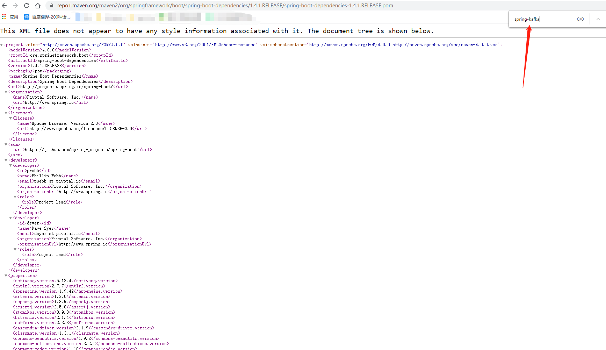
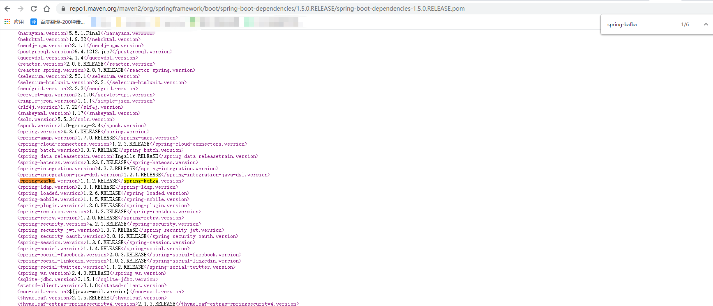

#  干货：自己开发了一个starter，如何轻松嵌入到使用不同版本的springboot框架的对接方

## 背景

* 最近应公司需求，开发了一个公司内部共用的二方库包。这里科普下：什么叫一方库，二方库，三方库。在阿里巴巴出品的 **泰山版《Java开发手册》 `附 2：专有名词解释`**章节中有提到

* 一方库：本工程内部子项目模块依赖的库（jar 包）

> 依赖本工程内部的**common**模块，里面通常会定义一些所有模块都会用到的一些基础功能，比如**全局异常码、分布式锁、统一响应实体等等**

* 二方库：公司内部发布到中央仓库，可供公司内部其它应用依赖的库（jar 包）

> 在互联网公司通常都是分事业部的，然后会存在一个叫**基础部门/基础中心**的事业部，这个部门可能会提供一些公司的基本类库，eg：mq相关的统一的amqp操作、rpc相关的统一的dubbo操作等等。最终这些都会以jar包的形式推送到maven仓库（公司内部需要搭建专有的maven仓库）。现在是spring boot的时代，如果公司用的是springboot这一套体系的话，这些jar包通常是以starter的方式提供，再利用springboot的自动装配机制，其他事业部可以很方便的对接。

* 三方库：公司之外的开源库（jar 包）

> 常见的springboot、mybatis

由于公司内部使用的是springboot相关的技术栈，因此，我开发的二方库包是以starter的方式提供的。整个对接流程只需要两步：

> 1、需要将二方库包推送至maven仓库
>
> 2、其他事业部只需要添加二方库包的maven坐标

这里会有一些小细节：二方库包是一个项目工程，也会依赖一些二方库、三方库的情况。通常，二方库内部依赖的jar包的scope都会设置为provider（**默认系统已经提供，不将二方库包内部依赖的jar包与对接方的项目耦合**），但是不乏会出现对接方无添加过相关依赖的情况，因此**需要添加符合对接方系统版本的依赖**。接下来，将以一个springboot引入spring-kafka的案例来理解如何找到合适的spring-kafka版本。

## 一、为什么maven会找不到spring-kafka的版本？

* 假设这么一个场景：我开发的二方库包使用到的技术栈是springboot，内部开发的其中一个功能需要依赖**spring-kafka**的三方库。众所周知，springboot为我们提供了及其舒适的开发环境，当我们引入springboot框架后，它内部已经定义了符合当前版本的所有三方库依赖。因此，假设我们要引入spring-kafka模块，只需要在pom.xml文件中添加如下坐标即可：

  ```xml
  <parent>
      <groupId>org.springframework.boot</groupId>
      <artifactId>spring-boot-starter-parent</artifactId>
      <version>2.4.4</version>
      <relativePath/> <!-- lookup parent from repository -->
  </parent>
  
  <!-- 只需要添加如下坐标即可，不需要指定版本 -->
  <dependencies>
      <dependency>
          <groupId>org.springframework.kafka</groupId>
          <artifactId>spring-kafka</artifactId>
      </dependency>
  </dependencies>
  ```

  在上述引入spring-kafka 模块时，我们没有指定version也可以使用。这是因为spring-boot-starter-parent内部的dependencyManagement中定义了spring-kafka的依赖，作为子模块，只需要引入即可，版本号会默认继承父工程中的定义。如果对接方使用的是**springboot 1.4.1.RELEASE**版本，这个时候，再使用同样的方式来引入spring-kafka的话，你会发现，maven找不到spring-kafka的版本：

  ```xml
  <parent>
      <groupId>org.springframework.boot</groupId>
      <artifactId>spring-boot-starter-parent</artifactId>
      <version>1.4.1.RELEASE</version>
      <relativePath/> <!-- lookup parent from repository -->
  </parent>
  
  <!-- 只需要添加如下坐标即可，不需要指定版本 -->
  <dependencies>
      <dependency>
          <groupId>org.springframework.kafka</groupId>
          <artifactId>spring-kafka</artifactId>
      </dependency>
  </dependencies>
  ```

  其大致的原因就是：在spring-boot-starter-parent中内部并没有依赖过**spring-kafka**，因此无法继承父类定义的版本，最终maven会提示找不到对应的版本。对接方一直以**springboot 1.4.1.RELEASE**版本正常开发，不可能为了集成你的二方库而升级springboot版本吧？因此，我们需要为对接方找到合适的spring-kafka版本。

## 二、如何找到springboot 1.4.1.RELEASE内部的依赖

* 其中最简单的一种方法就是在**idea中找到对应的pom文件定义**，这是一种方式。但是作为一个二方库提供者，后续可能会经常要处理因业务侧springboot版本不同而导致无法引入spring-kafka的问题。难道我们要本地每次修改maven中springboot的版本，通过maven下载后再使用idea查看吗？这显然有点麻烦。

* 还有一种做法是找官方springboot 1.4.1.RELEASE的文档，但连maven依赖中都没有涉及kafka，大概率是此版本没有集成kafka。

* 另外一种做法就是：参考此链接[https://repo1.maven.org/maven2/org/springframework/boot/spring-boot-dependencies/](https://repo1.maven.org/maven2/org/springframework/boot/spring-boot-dependencies/)。在此链接中，是springboot的所有版本的依赖，现在我们要看1.4.1.RELEASE版本的springboot内部依赖了哪些类库，我们可以这么定位：

  1. 定位版本

     

  2. 查看依赖pom文件

     

  3. 善于搜索（搜索spring-kafka）

     

     可以看到，在springboot 1.4.1.RELEASE版本中内部并没有依赖spring-kafka。此时该怎么办呢？**将springboot版本升级，继续往后搜索**，最终你会发现，在**1.5.0.RELEASE**版本中内部开始依赖了spring-kafka。因此，我们可以尝试，在maven中引入查找出来的版本**1.1.2.RELEASE**

     

     对应的pom.xml文件为

     ```xml
     <dependency>
         <groupId>org.springframework.kafka</groupId>
         <artifactId>spring-kafka</artifactId>
         <version>1.1.2.RELEASE</version>
     </dependency>
     ```

  在这种场景下，引入**1.1.2.RELEASE**版本可以解决问题，对接方的系统也能正常工作。
  
  也许这种方式在其他场景不适用，但这确实是一种方式，我们可以通过https://repo1.maven.org/maven2/org/springframework/boot/spring-boot-dependencies/链接找到每个springboot版本内部依赖的三方库，这比我们在idea中修改版本号再下载对应的版本方便的多。

## 三、总结

* **一种定位依赖版本的另外一种解决方案，如果你觉得我的文章有用的话，欢迎点赞、收藏和关注。:laughing:**
* **I'm a slow walker, but I never walk backwards**